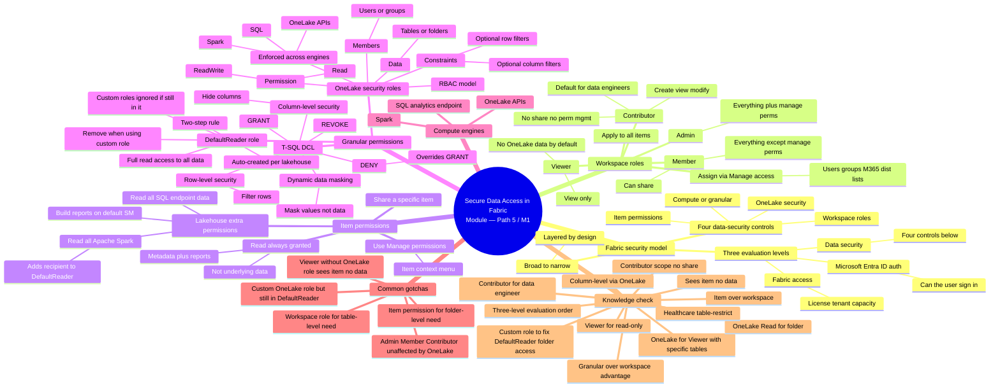
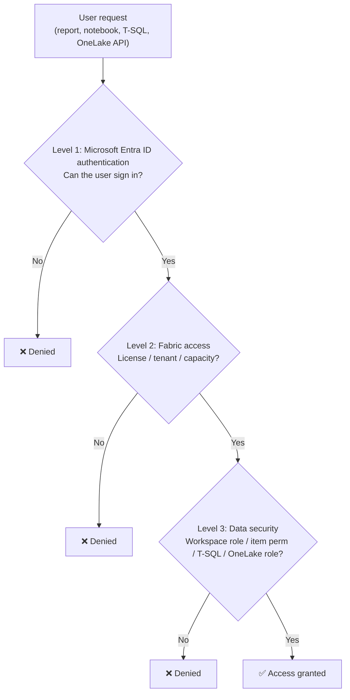
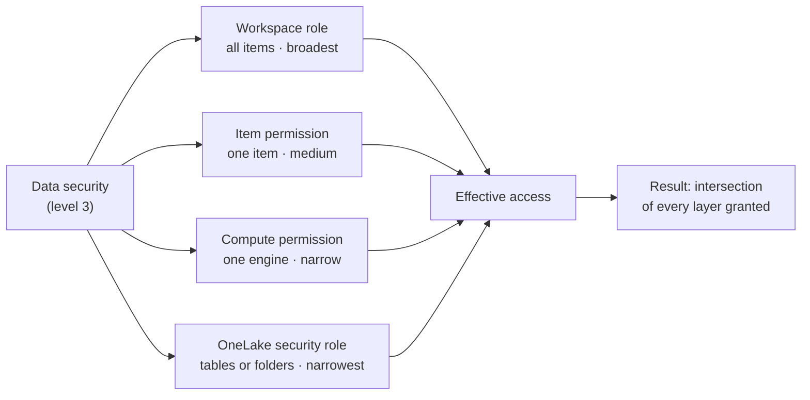
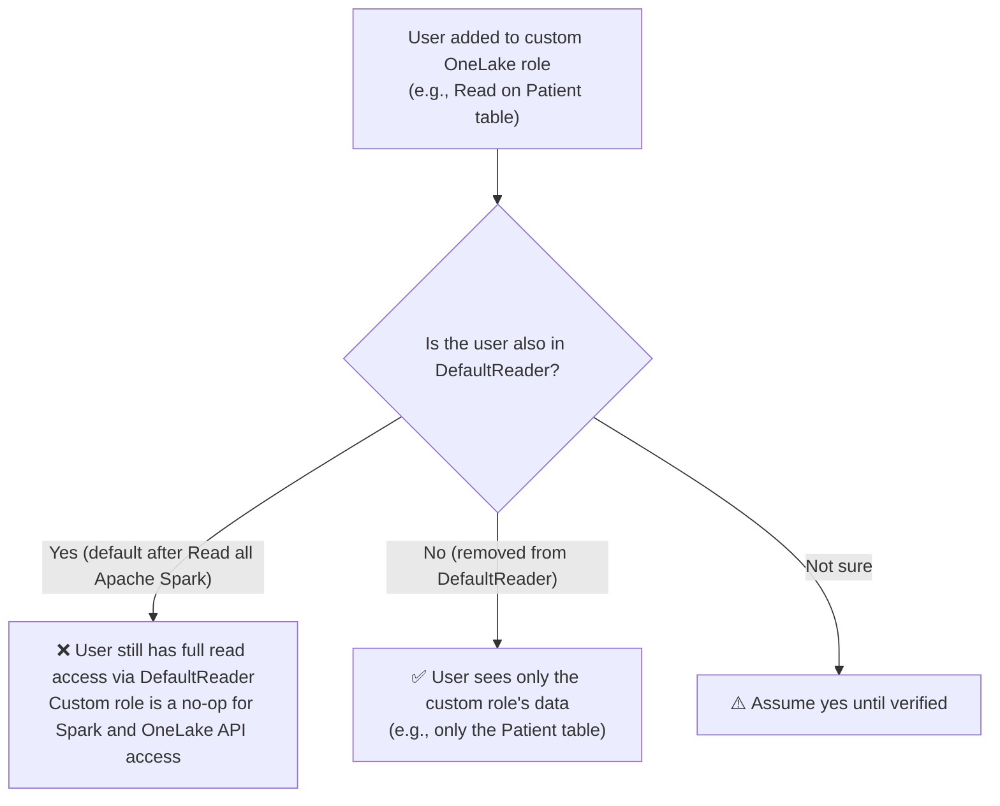
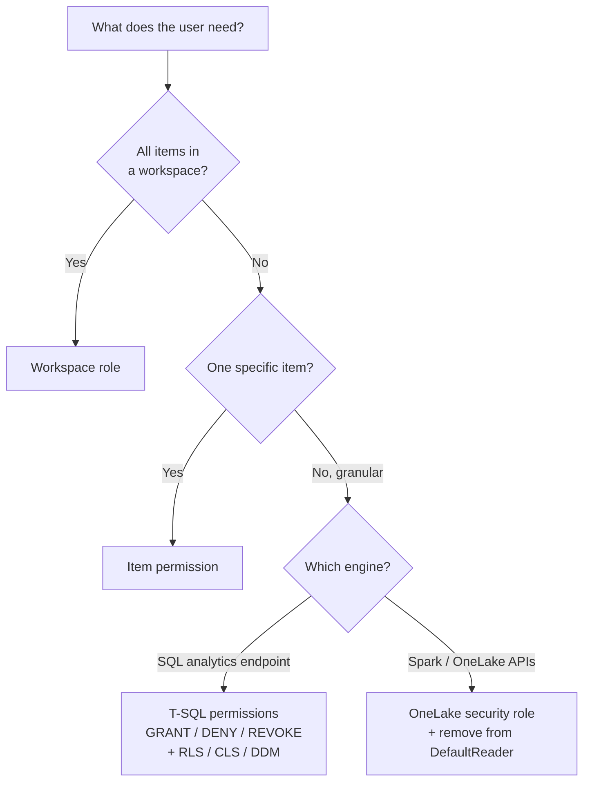

# Module Mind Map — Secure data access in Microsoft Fabric

> [!info] Single-page overview
> This file mirrors the mind map in `[[_MOC]]` as a standalone Mermaid document. Open in Obsidian's Mermaid preview or paste into [Mermaid Live Editor](https://mermaid.live).

## 🗺️ Mind map

## 🔁 Three evaluation levels (auxiliary diagram)

## 🛡️ Four data-security controls (auxiliary diagram)

## ⚠️ The `DefaultReader` gotcha (auxiliary diagram)

## 🧭 Decision rule (auxiliary diagram)

## 🧭 Related

- [[_MOC]] — module index
- [[Unit-1-Introduction]] · [[Unit-2-Understand-Fabric-Security-Model]] · [[Unit-3-Configure-Workspace-and-Item-Permissions]] · [[Unit-4-Apply-Granular-Permissions]] · [[Unit-5-Exercise]] · [[Unit-6-Knowledge-Check]] · [[Unit-7-Summary]]
- Sister modules:
  - [[../05-Path3-Module4-Enforce-Security/_MOC|Module P3-M4 — Enforce semantic model security]] (RLS + OLS at the *model* layer)
