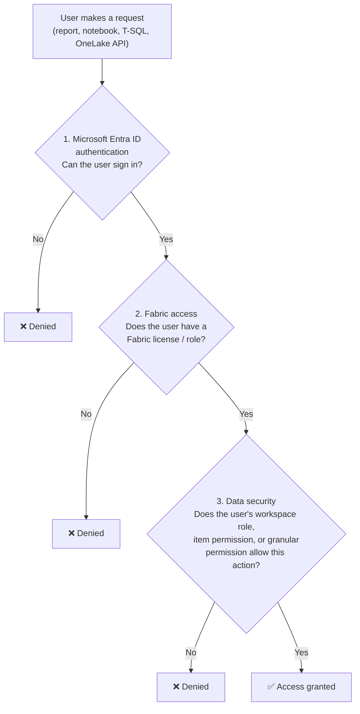
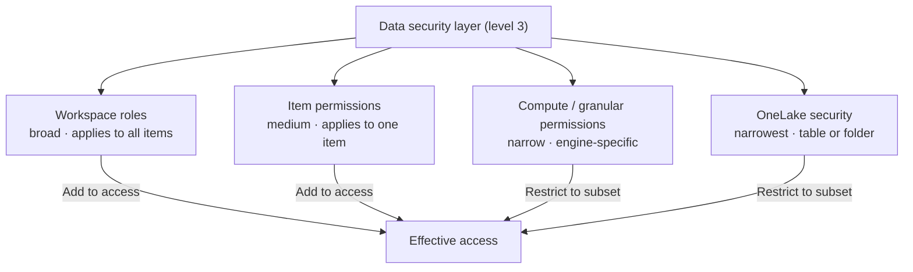
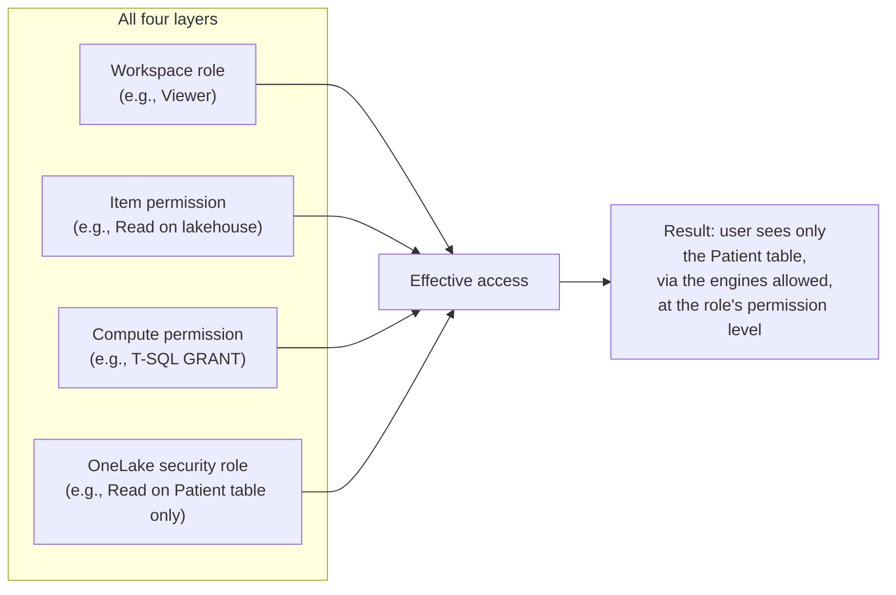

# Unit 2 — Understand the Fabric security model

## 🎯 Why this matters

Data access in organizations is often restricted by **users' responsibilities and roles**, and by the organization's **deployment patterns and data architecture**. Fabric has a **multi-layer security model** that lets you control permissions at different layers, so you can follow the **principle of least privilege** — restricting each user's access to only what they need.

> [!info] One model, four controls
> Fabric evaluates access sequentially through **three levels**, and the deepest of those levels (data security) has **four configurable controls**. Each control is independent, and the right one depends on *how broad* the user's access should be.

## 🔐 Three levels of access evaluation

Fabric evaluates access sequentially across three levels. **Every request** — from a Power BI report, a Spark notebook, a T-SQL query, or a OneLake API call — must pass all three.

1. **Microsoft Entra ID authentication** — checks whether the user can authenticate with Microsoft Entra ID. (If they can't sign in, nothing else matters.)
2. **Fabric access** — checks whether the user can access Fabric (license, tenant settings, capacity permissions).
3. **Data security** — checks whether the user can perform the requested action on a table or file.

> [!warning] Sequential, not parallel
> The three levels are checked **in order**. A user who passes the first two can still be blocked at the data-security layer. Don't think of it as "if they're a member, they're in" — the narrowest layer can still refuse.

## 🧱 The four data-security controls

The third level, **data security**, has **four primary access controls** that can be configured individually or together. Each provides increasingly specific control — from broad workspace-level access down to individual tables and folders within a data item.

| Control | Scope | Use when |
|---------|-------|----------|
| **Workspace roles** | All items in a workspace | User needs broad access across many items |
| **Item permissions** | A single item | User needs access to one or two items only |
| **Compute / granular permissions** | A specific engine (SQL endpoint, semantic model) | User needs specific action-level permission through one query engine |
| **OneLake security** | Tables or folders within an item | User needs access to a Fabric item but only specific data within it |

> [!success] Layered by design
> The four controls are **not alternatives** — they're **composable**. A typical secure Fabric item might combine a workspace role (broad read), an item permission (extra sharing), and a OneLake security role (data scope) — each one tightening the boundary the user can cross.

## 🔍 How the layers work together

### Workspace roles

**Workspace roles** apply to *all items* in a workspace. When you assign someone a workspace role, they can access every item in that workspace at the level the role allows. Use workspace roles when a user needs **broad access** to collaborate across multiple items.

> [!info] Workspace roles are the default boundary
> If you only ever set one layer, set workspace roles. They're the first gate every user passes through for every item in the workspace.

### Item permissions

**Item permissions** apply to a *single item*, like a specific lakehouse or warehouse. Instead of giving workspace-wide access, you share an individual item and choose what the recipient can do with it. Use item permissions when a user only needs access to **one or two items** — not the whole workspace.

> [!tip] Item permissions are the *exceptions* layer
> If the user isn't in the workspace, you don't add them to the workspace — you share the item directly with them. The narrower the surface area, the smaller the blast radius of a mistake.

### Compute permissions

**Compute permissions** apply within a *specific engine*, like the SQL analytics endpoint or semantic model. They include permissions such as **Read**, **ReadAll**, or **Write**. Use compute permissions to control what a user can do through a particular query engine.

### The "all data" warning

> [!warning] Across the first three layers, all data is visible
> "Across all three layers, when you grant someone access to an item, they can see **all** the data in it." — Microsoft Learn
>
> This is exactly why a fourth layer exists.

### OneLake security — the data-scope layer

**OneLake security** adds control *within* an item. Instead of giving access to all data, you create security roles that grant access to **specific tables or folders**. These restrictions apply **consistently across all compute engines** — Spark, SQL, and OneLake APIs. Use OneLake security when a user needs access to a Fabric item but should only see specific data within it.

> [!success] OneLake is the data-scope layer
> Workspace role = *which items*. Item permission = *which item*. Compute permission = *which engine*. OneLake = *which data inside*. Use the narrowest layer that still lets the user do their job.

## 📋 Quick decision guide

| Need | Use |
|------|-----|
| User needs access to *all items* in a workspace | **Workspace role** |
| User needs access to *one specific item* | **Item permission** |
| User needs to perform *specific actions* through a single engine (e.g., T-SQL `SELECT` only) | **Compute permission** |
| User needs access to *specific tables or folders* within an item, across engines | **OneLake security role** |

## 🔑 Key terms (flashcards)

- **Microsoft Entra ID authentication** — the first access check; can the user sign in?
- **Fabric access** — the second access check; does the user have a Fabric license and tenant permission?
- **Data security** — the third access check; does any of the four controls grant this action?
- **Workspace role** — broadest data-security control; applies to all items in a workspace.
- **Item permission** — medium-grained control; applies to a single shared item.
- **Compute permission** — engine-specific control (e.g., `Read`, `ReadAll`, `Write` on a SQL endpoint).
- **OneLake security** — narrowest data-security control; restricts access to specific tables or folders within an item, enforced across Spark, SQL, and OneLake APIs.
- **Principle of least privilege** — give every user the narrowest access that still lets them do their job.

## 🧭 Next

→ [Unit 3 — Configure workspace and item permissions](./Unit-3-Configure-Workspace-and-Item-Permissions.md)
← [Unit 1 — Introduction](./Unit-1-Introduction.md)
↑ [_MOC](./_MOC.md)
