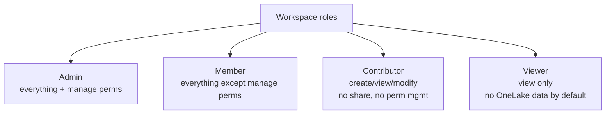
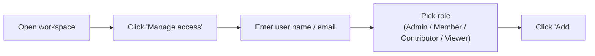
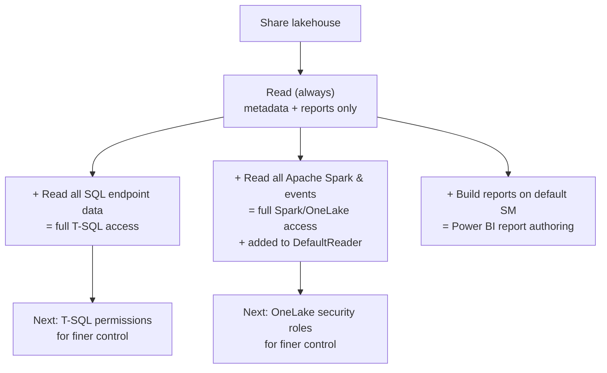

# Unit 3 — Configure workspace and item permissions

## 🎯 Why this matters

Suppose you're the **Fabric security admin** at a healthcare company. A new data engineer has joined the team and needs to:

- Create Fabric items in an existing workspace
- Read all data in an existing lakehouse in that workspace

Your first tool is **workspace roles**. Workspace roles are the broadest data-security control — they apply to *all items* in a workspace and are the right starting point whenever a user needs to collaborate across multiple items.

> [!info] Workspace roles are the broadest knob
> Workspace roles grant access to *every item* in a workspace at the level the role allows. They're fast to assign and the right choice when a user genuinely needs broad collaboration. For anything narrower, use item permissions (this unit) or OneLake security roles (next unit).

## 🏢 The four workspace roles

There are **four workspace roles**, from broadest to narrowest:

| Role | What it can do |
|------|----------------|
| **Admin** | Create, view, modify, **share**, and manage all content and data in the workspace, and **manage permissions** |
| **Member** | Create, view, modify, and **share** all content and data in the workspace |
| **Contributor** | Create, view, and modify all content and data in the workspace (**no share / no permission management**) |
| **Viewer** | **View** all content in the workspace; **cannot modify** anything |

> [!warning] Viewers don't see OneLake data by default
> "Viewers can see Fabric items listed in the workspace, but have no access to the underlying data stored in OneLake by default. Use OneLake security roles to grant Viewers access to specific tables or folders." — Microsoft Learn
>
> This is the *most-missed* detail in the entire module: **a Viewer can see the item exists, but the data is invisible to them until you add them to a OneLake security role.**

### Who can be assigned

Workspace roles can be assigned to **individuals, security groups, Microsoft 365 groups, and distribution lists**. Assigning to a group is the recommended way to manage access at scale — one group assignment covers every member.

> [!tip] Groups scale; individuals don't
> In production, always assign workspace roles to **Entra security groups**, never to individual users. Membership changes then become an IT task, not a Fabric admin task.

## 🛠️ Back to the scenario — pick the right role

The new data engineer needs to **create Fabric items** and **read all data in the existing lakehouse**. Walking through the four roles:

- ❌ **Admin** — too broad; gives share/permission management they don't need.
- ❌ **Member** — also too broad; gives share capabilities they don't need.
- ✅ **Contributor** — "grants those capabilities without giving them share or permission management capabilities."
- ❌ **Viewer** — can't create items or read OneLake data by default.

> [!success] The Contributor role is the right fit
> Contributor = the **default role** for someone who needs to do engineering work in a workspace but doesn't need to share or manage permissions.

## 📋 How to assign a workspace role

To add a user to a workspace role:

1. In the workspace, select **Manage access**.
2. Enter the user's name or email address.
3. Select the workspace role to assign and select **Add**.

> [!info] Reference
> Full permission matrix for every role: [Roles in workspaces](https://learn.microsoft.com/en-us/fabric/get-started/roles-workspaces).

## 🔧 Refine access with item permissions

A few months later, the data engineer's needs have changed. They no longer need to create Fabric items — they only need to read data from a **single lakehouse**. Keeping the Contributor role gives them more access than they need — it applies to every item in the workspace, not just the lakehouse.

**Item permissions** solve this. Different Fabric items have different permissions that can be granted when you share them. Instead of workspace membership, you **share a specific item** directly with a user and choose exactly what they can access.

> [!warning] Item permissions are a substitute, not an addition
> The unit's recommended flow is to **remove the engineer from the Contributor role and share the lakehouse with item permissions**. Don't stack workspace + item permissions — pick the narrowest layer that does the job.

### How to share an item

To share an item and configure its permissions:

1. Select the **ellipsis (...)** next to the item in the workspace.
2. Select **Manage permissions**.

> [!tip] Manage permissions, not just "Share"
> The "Share" button grants a default permission set. **Manage permissions** is where you fine-tune the exact permissions and add or remove specific users.

## 🏞️ Lakehouse sharing permissions (worked example)

When you share a lakehouse, **Read permission is always granted**. Read lets the recipient see the item's metadata and view any associated reports, but does **not** grant access to any underlying data in SQL or OneLake.

You can also grant **additional permissions**:

| Additional permission | What it allows |
|------------------------|----------------|
| **Read all SQL endpoint data** | Read data from the SQL analytics endpoint using T-SQL |
| **Read all Apache Spark and subscribe to events** | Read lakehouse data through Apache Spark and OneLake APIs |
| **Build reports on the default semantic model** | Create Power BI reports on the default semantic model |

> [!warning] Both data permissions grant access to **all** data in the lakehouse by default
> "Both additional data access permissions grant access to all data in the lakehouse by default. Granting **Read all Apache Spark and subscribe to events** also adds the recipient to the lakehouse's **DefaultReader** OneLake security role." — Microsoft Learn
>
> This is the bridge to Unit 4: if you want a recipient to see only *some* of the data, the additional data permissions aren't enough. You need OneLake security roles (or T-SQL permissions) on top.

## 🧭 Where item permissions end and OneLake begins

Use **T-SQL permissions** to restrict SQL endpoint access, and **OneLake security roles** to restrict Spark and OneLake API access. The next unit covers both in detail.

> [!info] See also
> - [Roles in workspaces](https://learn.microsoft.com/en-us/fabric/get-started/roles-workspaces) — full workspace role permission matrix
> - [Item permissions](https://learn.microsoft.com/en-us/fabric/security/permission-model#item-permissions?azure-portal=true) — full item-permission reference for every Fabric item type
> - [Give access to your workspace](https://learn.microsoft.com/en-us/fabric/get-started/give-access-workspaces) — admin walkthrough

## 🔑 Key terms (flashcards)

- **Admin** — broadest workspace role; everything + permission management.
- **Member** — everything except permission management.
- **Contributor** — create / view / modify; no share, no permission management. **Default for data engineers.**
- **Viewer** — view only; no OneLake data by default.
- **Item permission** — a per-item share permission, applied via **Manage permissions**.
- **DefaultReader** — a OneLake security role that's *automatically* created on every new lakehouse; grants full read access to all data. Recipients of the "Read all Apache Spark" item permission are added to it.
- **Manage access** — workspace-level UI for assigning workspace roles.
- **Manage permissions** — item-level UI for configuring per-item sharing.

## 🧭 Next

→ [Unit 4 — Apply granular permissions](./Unit-4-Apply-Granular-Permissions.md)
← [Unit 2 — Understand the Fabric security model](./Unit-2-Understand-Fabric-Security-Model.md)
↑ [_MOC](./_MOC.md)
