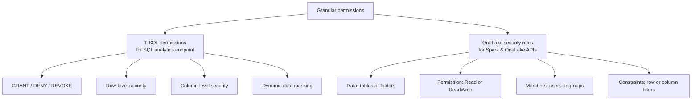
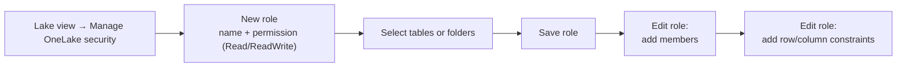
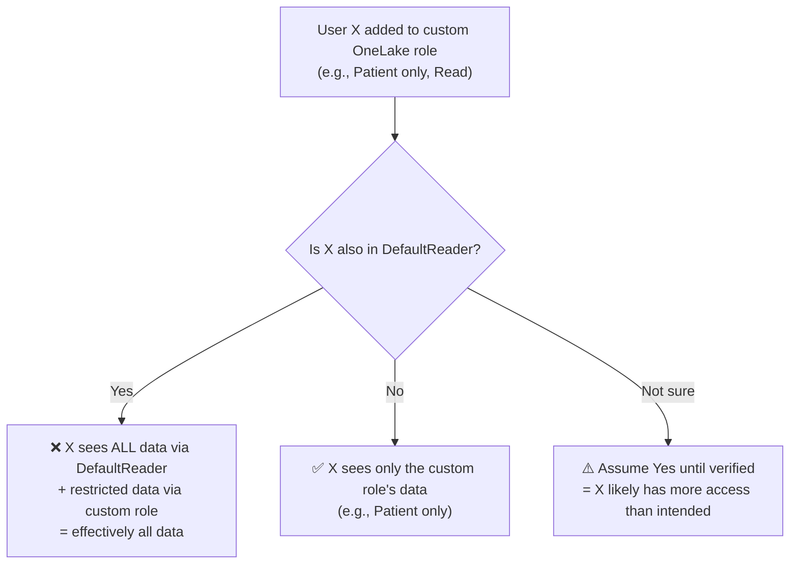

# Unit 4 — Apply granular permissions

## 🎯 Why this matters

**Item permissions** let you share a lakehouse — but they apply to *all the data in it*. Suppose the data engineer from the previous unit now only needs to see specific patient-records tables, not the entire lakehouse. To limit access to specific tables or folders, apply **row-level security**, or **restrict columns**, you need **granular permissions**. The approach depends on **how users access the data** — T-SQL endpoint, Spark, or OneLake APIs.

> [!info] Two engines, two mechanisms
> Fabric exposes two compute paths to the same underlying data:
> - **SQL analytics endpoint** → control with **T-SQL permissions** (`GRANT` / `DENY` / `REVOKE` + RLS + CLS + DDM).
> - **Spark and OneLake APIs** → control with **OneLake security roles** (RBAC).
>
> Pick the one that matches the user's access path. The data they see is the *intersection* of all the layers they've been granted.



## 🗄️ Apply granular permissions using T-SQL

**T-SQL permissions** are the compute permissions for the **SQL analytics endpoint**. When users query lakehouse data using T-SQL, apply granular permissions using **Data Control Language (DCL) commands**:

- [`GRANT`](https://learn.microsoft.com/en-us/sql/t-sql/statements/grant-transact-sql) — explicitly allow an action.
- [`DENY`](https://learn.microsoft.com/en-us/sql/t-sql/statements/deny-transact-sql) — explicitly **block** an action (overrides `GRANT`).
- [`REVOKE`](https://learn.microsoft.com/en-us/sql/t-sql/statements/revoke-database-permissions-transact-sql) — remove a previously granted or denied permission.

You can also apply:

- **[Row-level security](https://learn.microsoft.com/en-us/fabric/data-warehouse/row-level-security)** — filter which rows a user sees.
- **[Column-level security](https://learn.microsoft.com/en-us/fabric/data-warehouse/column-level-security)** — hide entire columns.
- **[Dynamic data masking](https://learn.microsoft.com/en-us/fabric/data-warehouse/dynamic-data-masking)** — mask sensitive values (e.g., show only the last 4 digits of a national ID) without changing the underlying data.

```sql
-- Typical T-SQL granular permission pattern
GRANT SELECT ON SCHEMA::dbo TO [analyst@contoso.com];
DENY  SELECT ON dbo.Patient.SSN TO [analyst@contoso.com];   -- overrides GRANT
REVOKE SELECT ON dbo.Salary FROM [former_employee@contoso.com];
```

> [!tip] DENY beats GRANT
> In SQL Server, `DENY` always overrides `GRANT` for the same principal/permission pair. Use `DENY` for hard blocks; use `REVOKE` to undo a previous grant without leaving a denial behind.

> [!info] Same T-SQL syntax you already know
> These are the same DCL statements and the same RLS/CLS/DDM concepts from Azure SQL Database and SQL Server — just running against the Fabric SQL analytics endpoint. If you've secured a SQL DB before, the patterns are familiar.

## 🛡️ Apply granular permissions using OneLake security

**OneLake security** uses a **role-based access control (RBAC) model**. You create security roles that define:

- **who** can access **which tables or folders**
- **what level** of access they have (**Read** or **ReadWrite**)
- **optional constraints** like row or column filters

> [!success] One role, one engine-agnostic boundary
> OneLake security roles are enforced **consistently across all Fabric compute engines** — Spark, SQL, and OneLake APIs. A user restricted to the `Patient` table by an OneLake role sees only that table no matter which engine they use.

### Who it applies to (and doesn't)

> [!warning] OneLake security does **not** restrict workspace Admins / Members / Contributors
> "Users with **Admin**, **Member**, or **Contributor** workspace roles already have full read and write access to all OneLake data — OneLake security roles don't restrict that access." — Microsoft Learn
>
> Use OneLake security roles to grant specific data access to users in the **Viewer** workspace role or with only **Read** item permission, who have no OneLake data access by default. Only workspace **Admin** and **Member** roles can create or modify OneLake security roles.

| Workspace role | OneLake data access by default | OneLake security role restricts them? |
|----------------|--------------------------------|--------------------------------------|
| Admin | Full read + write | ❌ No |
| Member | Full read + write | ❌ No |
| Contributor | Full read + write | ❌ No |
| Viewer | **None** | ✅ Yes (this is the primary use case) |
| Read item permission only | **None** | ✅ Yes |

### The four components of an OneLake security role

Each OneLake security role has four components:

| Component | What it is |
|-----------|------------|
| **Data** | The tables or folders that users can access |
| **Permission** | The level of access: **Read** (view data) or **ReadWrite** (view + edit data in specific tables or folders *without* granting a workspace write role) |
| **Members** | The users or groups assigned to the role |
| **Constraints** | Optional row or column filters applied to the data in the role |

### How to create an OneLake security role

1. In the **lake view** of the lakehouse, select **Manage OneLake security** from the ribbon.
2. Select **New role**, enter a role name, and choose the permission type (**Read** or **ReadWrite**).
3. Select the **tables or folders** to grant access to, then save the role. After creation, edit the role to add members and optional row or column constraints.



## ⚠️ The `DefaultReader` role — the most-missed detail

> [!warning] Every new lakehouse ships with a `DefaultReader` role
> "Every new lakehouse automatically includes a **DefaultReader** role. When you share a lakehouse with the **Read all Apache Spark and subscribe to events** permission, the recipient is added to `DefaultReader` and gets read access to **all** data." — Microsoft Learn
>
> **When you restrict a user to a custom role, also remove them from `DefaultReader`** — otherwise they still have full read access through the default role.



> [!success] The two-step rule
> 1. Add the user to your **custom** OneLake role.
> 2. **Remove them from `DefaultReader`** in the same edit.
>
> Skip step 2 and your custom role is a no-op for Spark and OneLake API access.

> [!info] See also
> [OneLake security access control model](https://learn.microsoft.com/en-us/fabric/onelake/security/data-access-control-model) for the full RBAC reference.

## 📋 Quick decision table — granular permissions

| User access path | Mechanism | Where you configure it |
|------------------|-----------|------------------------|
| Querying via T-SQL (SQL analytics endpoint) | **T-SQL permissions** — `GRANT` / `DENY` / `REVOKE`, RLS, CLS, DDM | T-SQL against the SQL endpoint |
| Querying via Apache Spark | **OneLake security roles** | Lake view → Manage OneLake security |
| Querying via OneLake APIs | **OneLake security roles** | Lake view → Manage OneLake security |
| Multiple engines, want one rule | **OneLake security roles** (engine-agnostic) | Lake view → Manage OneLake security |

## 🔑 Key terms (flashcards)

- **DCL (Data Control Language)** — T-SQL `GRANT` / `DENY` / `REVOKE` statements that manage permissions.
- **Row-level security (RLS)** — filter which *rows* a user sees, enforced by the SQL engine.
- **Column-level security (CLS)** — hide entire *columns* from a user.
- **Dynamic data masking (DDM)** — mask sensitive values (e.g., show `xxx-xx-1234` for an SSN) without changing the data.
- **OneLake security role** — an RBAC role that grants Read/ReadWrite to specific tables or folders, enforced across Spark, SQL, and OneLake APIs.
- **DefaultReader** — the auto-created OneLake role on every new lakehouse that grants full read access to all data; recipients of the "Read all Apache Spark" item permission are added to it automatically.
- **OneLake security access control model** — the documented RBAC model behind OneLake security roles.
- **`DENY` overrides `GRANT`** — in T-SQL, `DENY` always wins over `GRANT` for the same principal/permission pair.

## 🧭 Next

→ [Unit 5 — Exercise](./Unit-5-Exercise.md)
← [Unit 3 — Configure workspace and item permissions](./Unit-3-Configure-Workspace-and-Item-Permissions.md)
↑ [_MOC](./_MOC.md)
