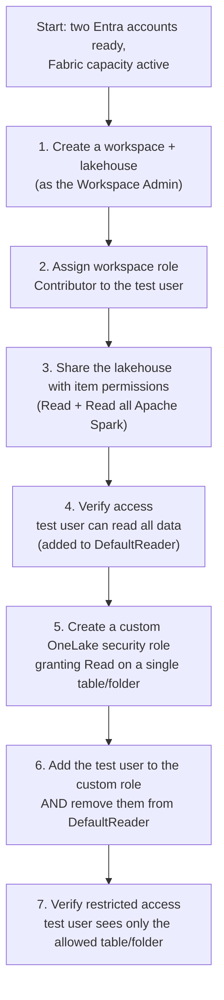

# Unit 5 — Exercise: Secure data access in Microsoft Fabric

## 🎯 What this lab is

In this exercise, you practice **securing data access in Microsoft Fabric** using all three of the data-security controls covered in this module: **workspace roles**, **item permissions**, and **OneLake security roles**. It is a hands-on, in-product lab — the actual exercise instructions and the live environment are launched from the Microsoft Learn page (not reproduced here).

> [!info] Lab summary
> The lab walks you through assigning workspace roles, sharing a lakehouse with item permissions (and seeing the `DefaultReader` side-effect), then tightening access with a custom OneLake security role. You'll switch between two user accounts to verify each layer from both sides.

## 🧰 Prerequisites

> [!warning] Two user accounts required
> This exercise requires **two user accounts**:
> 1. One assigned the **Workspace Admin** role.
> 2. A second account to be assigned permissions throughout the lab.
>
> Set up both accounts before you begin. To assign workspace roles, see [Give access to your workspace](https://learn.microsoft.com/en-us/fabric/get-started/give-access-workspaces).

> [!warning] Fabric capacity required
> You need access to a **Fabric paid or trial capacity** to complete this exercise. See [Fabric trial](https://aka.ms/fabrictrial) for information about the free trial.

| Requirement | Why |
|-------------|-----|
| Fabric trial or paid capacity | The lab creates a workspace + lakehouse that need a backing capacity |
| Two Microsoft Entra user accounts | One Admin + one test user to verify access from each side |
| Workspace Admin role on the first account | Required to assign workspace roles and create OneLake security roles |

## 🧪 What you'll do (overview)

The lab combines all three data-security layers covered in Units 2–4. At a high level you will:

## 🔍 What you'll observe

Each step has a verification checkpoint where you sign in as the **second user** and confirm what they can and cannot see. That's the value of using two accounts: every security change is *tested from the consumer's side*, not just configured from the admin's side.

| Layer you configured | Verification (signed in as test user) |
|----------------------|----------------------------------------|
| Workspace role (Contributor) | Can see the workspace, the lakehouse item, and *all* OneLake data |
| Item permission (Read all Apache Spark) | Added to `DefaultReader` → can read all lakehouse data via Spark/OneLake |
| OneLake security role (custom, Read on one table) | **After removal from `DefaultReader`** → can read only the custom role's table/folder |

> [!success] The lab's punchline
> The "before custom role" and "after custom role + removed from `DefaultReader`" verifications are the most important moments. They prove the central lesson of Unit 4: **a custom OneLake role does nothing until the user is also removed from `DefaultReader`.**

## 🚀 Launch the lab

The exercise launches an external hands-on environment. Open it from the Microsoft Learn page:

➡ **[Launch the exercise on Microsoft Learn](https://learn.microsoft.com/en-us/training/modules/secure-data-access-in-fabric/5-exercise-secure-data-access)**

## 🧭 Pre-lab reading order

Before you start clicking, re-skim these sections — they map directly to lab steps:

- [[Unit-2-Understand-Fabric-Security-Model|The four data-security controls]] — the mental model behind every choice you'll make.
- [[Unit-3-Configure-Workspace-and-Item-Permissions|Workspace roles + lakehouse sharing]] — the Contributor role and the `DefaultReader` side-effect of "Read all Apache Spark."
- [[Unit-4-Apply-Granular-Permissions|OneLake security roles + `DefaultReader` removal]] — the two-step rule.

## 🔑 Key terms (flashcards)

- **Two-account verification pattern** — the most reliable way to validate Fabric security is to sign in as the test user and confirm what they can see, not just configure from the admin side.
- **`DefaultReader` side-effect** — granting "Read all Apache Spark and subscribe to events" *automatically* adds the recipient to the lakehouse's `DefaultReader` role.
- **Two-step OneLake rule** — (1) add the user to your custom role, (2) **remove them from `DefaultReader`** — otherwise the custom role is a no-op.
- **Capacity requirement** — Fabric labs (and any Fabric workspace that creates items) need a paid or trial Fabric capacity in the tenant.

## 🧭 Next

→ [Unit 6 — Knowledge check](./Unit-6-Knowledge-Check.md)
← [Unit 4 — Apply granular permissions](./Unit-4-Apply-Granular-Permissions.md)
↑ [_MOC](./_MOC.md)
