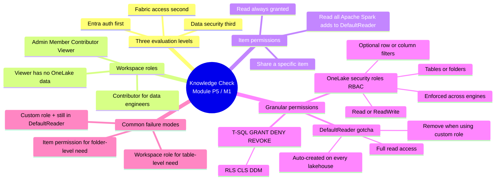

# Unit 6 — Knowledge check

> [!warning] Answer provenance
> Microsoft Learn intentionally does **not** publish the correct answers for knowledge-check questions. The answers below are **derived from the unit content** and the wording of each question. Treat them as best-effort study notes — verify against the live module if you fail the check.
>
> The page has two question sets: a **3-question warm-up with per-question feedback**, followed by a **9-question graded assessment** where you only see pass/fail at the end. Both sets are reproduced below.

## 📋 Warm-up questions (with feedback)

> [!info] The first 3 questions on the live page give you feedback after each answer. Use them to catch obvious misses before the graded set.

### Question 1

> What is the order of evaluation for access in Fabric?

- Data security, Fabric access, Microsoft Entra ID authentication
- **Microsoft Entra ID authentication, Fabric access, Data security** ✅
- Fabric access, Microsoft Entra ID authentication, Data security

### Question 2

> A data engineer needs to create Fabric items and read data in an existing lakehouse. Which workspace role should you assign?

- Viewer
- **Contributor** ✅
- Admin

### Question 3

> A user with the Viewer workspace role needs read access to only specific tables in a lakehouse. What should you use?

- **OneLake security roles** ✅
- Data Manipulation Language (DML)
- Item permissions

## 📋 Graded questions (pass/fail only)

### Question 4

> A user reports they cannot access certain folders in a lakehouse to which they should have access. Upon review, you notice they are in the `DefaultReader` role. What might be a likely solution?

- Increase the user's access by granting them Admin workspace role.
- Upgrade the user to a Member workspace role to bypass role restrictions.
- **Ensure the user is added to a custom OneLake security role that grants specific access to those folders.** ✅

> The trap is that `DefaultReader` is *not* the problem (in fact it's the one role that already grants access). The real issue is that the user is *only* in `DefaultReader` and has no custom role for the specific folders. Granting Admin/Member bypasses the entire problem and grants far more than needed.

### Question 5

> Which permission model should be applied if a user needs access to specific columns in a table within a lakehouse?

- Item permissions to share the entire lakehouse with the user
- Workspace roles to grant access to the entire lakehouse
- **Column-level security using OneLake security roles** ✅

> Item permissions and workspace roles are both item/workspace-level; neither can restrict to specific columns. OneLake security roles support optional **column constraints**, which is the right tool.

### Question 6

> In the context of Microsoft Fabric, what is the primary function of the Contributor workspace role?

- To view all content in the workspace without modifying it.
- **To create, view, and modify all content and data in the workspace without sharing or permission management capabilities.** ✅
- To create, view, modify, and share all content and data in the workspace.

> "Create, view, modify, and **share**" is the **Member** role. "Create, view, and modify" with no share is **Contributor**. The two are easy to mix up.

### Question 7

> What is a key advantage of using OneLake security roles over workspace roles in Microsoft Fabric?

- They eliminate the need for Microsoft Entra ID authentication.
- **They provide granular access control to specific tables or folders within a Fabric item.** ✅
- They automatically apply to all items within a workspace.

> OneLake security roles do **not** eliminate Entra auth (that's a separate platform check) and they **don't** apply to all items in a workspace (that's a workspace role). Their whole point is **table/folder granularity within a single item**.

### Question 8

> You need to ensure that a group of users can view but not edit data in a specific folder within a lakehouse. Which approach should you take in Microsoft Fabric?

- Use item permissions to grant read access to the entire lakehouse.
- Assign the users a Contributor role for the workspace.
- **Create an OneLake security role with Read permission for the folder.** ✅

> Item permissions grant access to the **entire** item (not a folder). Contributor is a workspace role and over-grants (also lets them create/modify). The only mechanism that scopes to a specific **folder** with **Read** is an OneLake security role.

### Question 9

> When should you use item permissions over workspace roles in Microsoft Fabric?

- When a user needs to create and manage all content within a workspace.
- **When a user needs access to only a specific item, such as a single lakehouse, rather than the entire workspace.** ✅
- When a user needs to view all items in a workspace but not modify them.

> "Create and manage all content" is Admin/Member. "View all items but not modify" is the Viewer workspace role. Item permissions exist specifically to grant access to **one item**, not the whole workspace.

### Question 10

> A new member of your team needs to view all content in a workspace but should not modify any data. Which workspace role should they be assigned in Microsoft Fabric?

- Admin
- **Viewer** ✅
- Contributor

### Question 11

> Your organization uses Microsoft Fabric to manage healthcare data. Team members need access to specific patient records but should not have access to insurance claims or clinical trial data. Which approach should you take to ensure the team members have the correct access within OneLake?

- Use item permissions to share the entire lakehouse with the team.
- **Create OneLake security roles and restrict access to specific tables containing patient records.** ✅
- Assign workspace roles to the team members to provide access to all data in the workspace.

> This is the canonical healthcare scenario from Unit 1. Workspace roles and item permissions are item/workspace-level — they can't pick out specific **tables**. OneLake security roles are designed for exactly this: grant access to the `Patient` table, deny access to `InsuranceClaims` and `ClinicalTrials` (or just don't include them in the role's data scope).

### Question 12

> A user reports that they cannot access any data in a lakehouse even though they can see the lakehouse item in their workspace. What is the most likely cause of this issue?

- The user is not authenticated with Microsoft Entra ID.
- The user is assigned the Admin role in the workspace.
- **The user does not have the appropriate OneLake security role assigned.** ✅

> If Entra auth were broken, the user couldn't see the lakehouse *item* either. If they were Admin, they'd have full access. The exact symptom — "sees the item but no data" — is the textbook **Viewer-without-OneLake-role** scenario from Unit 3 ("Viewers can see Fabric items listed in the workspace, but have no access to the underlying data stored in OneLake by default").

## ✅ Answer key (derived)

| # | Correct answer | Why the others are wrong | Source unit |
|---|----------------|--------------------------|-------------|
| 1 | **Microsoft Entra ID authentication → Fabric access → Data security** | The other two orderings would have Entra or Fabric access checked *after* data security, which would let unauthenticated users query data. | [[Unit-2-Understand-Fabric-Security-Model]] |
| 2 | **Contributor** | Viewer can't create items or read OneLake by default; Admin grants unnecessary share/permission-management capabilities. | [[Unit-3-Configure-Workspace-and-Item-Permissions]] |
| 3 | **OneLake security roles** | DML (`INSERT`/`UPDATE`/`DELETE`) writes data, doesn't read it; item permissions can't restrict to *specific tables*. | [[Unit-4-Apply-Granular-Permissions]] |
| 4 | **Custom OneLake security role + leave `DefaultReader` alone, or remove only if needed** | Admin/Member bypass the security model entirely and over-grant. | [[Unit-4-Apply-Granular-Permissions]] |
| 5 | **Column-level security using OneLake security roles** | Item/workspace permissions are item/workspace-level — they can't restrict to specific *columns*. | [[Unit-4-Apply-Granular-Permissions]] |
| 6 | **Create, view, modify — no share, no permission management** | "View without modifying" is Viewer; "create + share" is Member. | [[Unit-3-Configure-Workspace-and-Item-Permissions]] |
| 7 | **Granular access to specific tables or folders** | OneLake roles don't replace Entra auth, and they don't auto-apply to other items. | [[Unit-4-Apply-Granular-Permissions]] |
| 8 | **OneLake security role with Read permission for the folder** | Item permissions are item-scoped; Contributor over-grants. | [[Unit-4-Apply-Granular-Permissions]] |
| 9 | **User needs access to only a specific item** | "Manage all content" → workspace role; "view all items" → Viewer role. | [[Unit-3-Configure-Workspace-and-Item-Permissions]] |
| 10 | **Viewer** | Admin/Contributor can modify. | [[Unit-3-Configure-Workspace-and-Item-Permissions]] |
| 11 | **OneLake security roles, restricted to specific patient-records tables** | Item/workspace permissions are item/workspace-level — no table granularity. | [[Unit-4-Apply-Granular-Permissions]] |
| 12 | **No appropriate OneLake security role assigned** | Entra failure would block seeing the item; Admin would see all data. | [[Unit-3-Configure-Workspace-and-Item-Permissions]] |

## 🧠 Why these answers (linking back to the module)

## 🎯 Re-study pointers

> [!tip] If you missed a question, re-read:
> - Q1, Q2, Q3 (warm-up) → [[Unit-2-Understand-Fabric-Security-Model]] and [[Unit-3-Configure-Workspace-and-Item-Permissions]]
> - Q4 → "The `DefaultReader` role" section in [[Unit-4-Apply-Granular-Permissions]]
> - Q5 → "The four components of an OneLake security role" in [[Unit-4-Apply-Granular-Permissions]]
> - Q6, Q10 → "The four workspace roles" table in [[Unit-3-Configure-Workspace-and-Item-Permissions]]
> - Q7, Q8, Q11, Q12 → "Who it applies to (and doesn't)" + the decision table in [[Unit-4-Apply-Granular-Permissions]]
> - Q9 → "How to share an item" in [[Unit-3-Configure-Workspace-and-Item-Permissions]]

## 🔑 Key terms (flashcards)

- **Three evaluation levels** — Entra ID authentication → Fabric access → Data security (sequential, in order).
- **Contributor** — the default workspace role for a data engineer; create / view / modify, no share, no permission management.
- **Viewer** — view-only workspace role; no OneLake data access by default until added to an OneLake security role.
- **Item permission** — share-time permission on a single Fabric item; Read is always granted, additional data permissions add to `DefaultReader`.
- **OneLake security role** — RBAC role granting Read/ReadWrite to specific tables or folders, enforced across Spark, SQL, and OneLake APIs.
- **`DefaultReader`** — auto-created OneLake role on every new lakehouse; grants full read to all data; must be removed when using a custom role to actually restrict access.
- **Column-level security** — OneLake security role with a column constraint, restricts which columns a user can see.
- **Healthcare scenario** — canonical reason to use OneLake roles: patient records table granted, insurance claims + clinical trials not granted.

## 🧭 Next

→ [Unit 7 — Summary](./Unit-7-Summary.md)
← [Unit 5 — Exercise](./Unit-5-Exercise.md)
↑ [_MOC](./_MOC.md)
