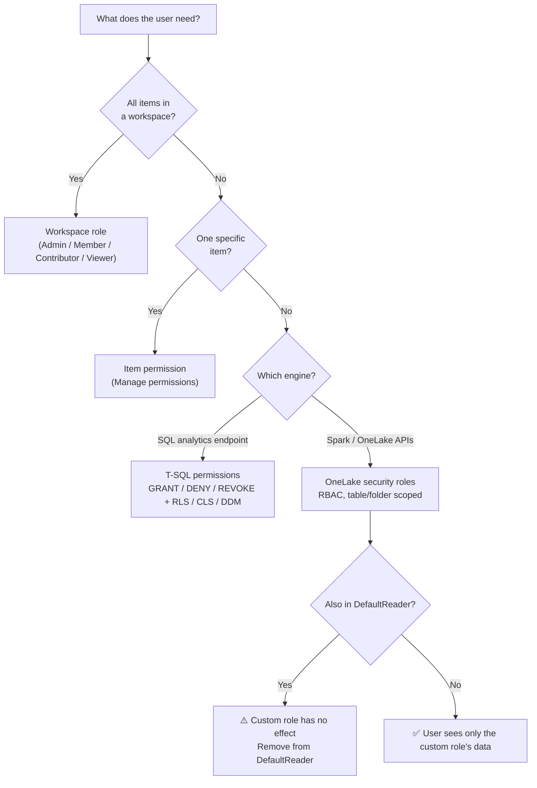

# Unit 7 — Summary

## 🎯 The one-paragraph recap

**Securing data in Microsoft Fabric** starts with **choosing the right level of access for each user**. In this module, you learned how **Fabric's layered security model** works — from broad workspace roles down to granular table and folder controls — and **when to use each layer**. The decision is the entire module: pick the narrowest layer that still lets the user do their job, and **combine layers** when one isn't enough.

> [!info] The decision rule (memorize this)
> 1. **Workspace role** — when users need access to *all items* in a workspace.
> 2. **Item permission** — when they need access to a *specific item*, like a single lakehouse.
> 3. **T-SQL permissions** — when they need granular access via the **SQL analytics endpoint**.
> 4. **OneLake security roles** — when they need granular access via **Spark and OneLake APIs**.

## 🔑 Key takeaways

> [!success] The five things to remember
> 1. **Three evaluation levels, in order** — Entra ID authentication → Fabric access → Data security. Failing any one denies the request.
> 2. **Four data-security controls** — workspace roles, item permissions, compute permissions, OneLake security. Each is narrower than the last.
> 3. **Default workspace role for a data engineer = Contributor.** Admin/Member/Contributor all have full OneLake data; **Viewer** has *none* by default.
> 4. **Sharing a lakehouse with "Read all Apache Spark"** automatically adds the recipient to `DefaultReader` — they see *all* data unless you remove them from that role.
> 5. **OneLake security roles are the data-scope layer.** They restrict users to specific tables or folders, enforced consistently across Spark, SQL, and OneLake APIs. **They don't restrict workspace Admin/Member/Contributor.**

## 📋 When to use what (cheat sheet)

| Need | Layer | Where to configure |
|------|-------|-------------------|
| User needs access to **all items in a workspace** | Workspace role (Admin / Member / Contributor / Viewer) | Workspace → Manage access |
| User needs access to **one item** only (a single lakehouse or warehouse) | Item permission | Item → Manage permissions |
| User needs **specific action** through the **SQL analytics endpoint** | T-SQL permissions (`GRANT`/`DENY`/`REVOKE`, RLS, CLS, DDM) | T-SQL against the SQL endpoint |
| User needs **specific tables or folders** across Spark and OneLake APIs | **OneLake security role** | Lake view → Manage OneLake security |
| User needs **specific columns** of a table | OneLake security role with **column constraint** | Lake view → Manage OneLake security |
| User needs **specific rows** of a table | OneLake security role with **row constraint** *or* T-SQL RLS on the SQL endpoint | Lake view → Manage OneLake security, or T-SQL |

## 🔗 Cross-cutting reminders

- **Layer, don't replace.** Workspace roles + item permissions + granular controls can stack. The narrowest layer wins.
- **Always test from the consumer's side.** Use a second Entra account to verify what the user actually sees, not what you *configured* — this is the whole point of the lab's two-account setup.
- **The `DefaultReader` two-step:** (1) add the user to your custom OneLake role, (2) **remove them from `DefaultReader`** in the same edit. Skip step 2 and your custom role is a no-op.
- **T-SQL `DENY` overrides `GRANT`.** Use `DENY` for hard blocks; use `REVOKE` to undo a previous grant.

## 📚 Further reading

- [Microsoft Fabric permission model](https://learn.microsoft.com/en-us/fabric/security/permission-model) — the canonical reference for every layer.
- [Get started with OneLake security](https://learn.microsoft.com/en-us/fabric/onelake/security/get-started-onelake-security) — hands-on tour of OneLake roles.
- [Roles in workspaces](https://learn.microsoft.com/en-us/fabric/get-started/roles-workspaces) — full permission matrix for every workspace role.
- [OneLake security access control model](https://learn.microsoft.com/en-us/fabric/onelake/security/data-access-control-model) — the RBAC model behind OneLake roles.
- [Row-level security (Fabric warehouse)](https://learn.microsoft.com/en-us/fabric/data-warehouse/row-level-security) · [Column-level security](https://learn.microsoft.com/en-us/fabric/data-warehouse/column-level-security) · [Dynamic data masking](https://learn.microsoft.com/en-us/fabric/data-warehouse/dynamic-data-masking) — the three T-SQL granular mechanisms.
- [T-SQL `GRANT`](https://learn.microsoft.com/en-us/sql/t-sql/statements/grant-transact-sql) · [`DENY`](https://learn.microsoft.com/en-us/sql/t-sql/statements/deny-transact-sql) · [`REVOKE`](https://learn.microsoft.com/en-us/sql/t-sql/statements/revoke-database-permissions-transact-sql) — DCL syntax reference.

## 🧭 Module complete

> [!success] What you can now do
> Configure the right level of access for every user — from workspace roles down to OneLake security roles — following the **principle of least privilege**. You can map a real organization (data engineers, analysts, report consumers) to the right combination of workspace role, item permission, and granular data control, and you know the gotchas to watch for (especially `DefaultReader`).

## 🔑 Key terms (flashcards)

- **Layered security model** — three evaluation levels × four data-security controls, each composable.
- **Principle of least privilege** — narrowest access that still lets the user do their job.
- **Decision rule** — workspace role → item permission → T-SQL permission (for SQL) or OneLake security role (for Spark/OneLake).
- **`DefaultReader`** — auto-created OneLake role on every new lakehouse; the most-missed gotcha when using custom OneLake roles.
- **OneLake security role** — RBAC role that scopes access to specific tables or folders, enforced across all Fabric compute engines.

## 🧭 Module navigation

| # | Unit | Link |
|---|------|------|
| 1 | Introduction | [[Unit-1-Introduction]] |
| 2 | Understand the Fabric security model | [[Unit-2-Understand-Fabric-Security-Model]] |
| 3 | Configure workspace and item permissions | [[Unit-3-Configure-Workspace-and-Item-Permissions]] |
| 4 | Apply granular permissions | [[Unit-4-Apply-Granular-Permissions]] |
| 5 | Exercise | [[Unit-5-Exercise]] |
| 6 | Knowledge check | [[Unit-6-Knowledge-Check]] |
| 7 | Summary | _(you are here)_ |

↑ [_MOC](./_MOC.md)
