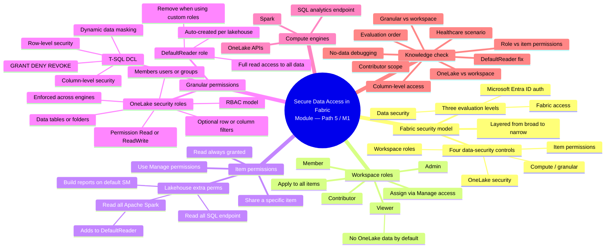

# Module — Secure data access in Microsoft Fabric

> [!info] Module map
> This is the **first module of Path 5** in the Fabric Analytics Engineer track and the **gateway** to Fabric administration. The previous path taught you to model, query, and secure *a single semantic model* with RLS and OLS. This module zooms out: the **entire Fabric platform** has its own layered security model, and every workspace, lakehouse, warehouse, and OneLake folder is a place where access can — and must — be controlled. Mastery here is what lets you put the right data in front of the right people, from data engineers who need to build pipelines, to analysts who need to query a single dataset, to report consumers who only need to view a dashboard. The guiding principle is **least privilege**: give every user exactly the access they need, no more.

## 🎯 Learning objectives (from Microsoft Learn)

By the end of this module you should be able to:

1. **Describe the Fabric security model** — recognize the three sequential access-evaluation levels (Entra ID → Fabric access → data security) and the four data-security controls (workspace roles, item permissions, compute/granular permissions, OneLake security).
2. **Configure workspace and item permissions** — assign the right workspace role (Admin / Member / Contributor / Viewer) and use item-level sharing to give least-privilege access to a specific lakehouse or warehouse.
3. **Apply granular permissions** — use T-SQL DCL (`GRANT` / `DENY` / `REVOKE`) for SQL analytics endpoint access, plus row-level, column-level, and dynamic data masking; use **OneLake security roles** (RBAC) to control Spark and OneLake API access to specific tables or folders.
4. **Recognize the `DefaultReader` role gotcha** — understand that every new lakehouse ships with a `DefaultReader` role that grants full read access, and that custom roles must explicitly *remove* users from `DefaultReader` to actually restrict them.

## 🧠 Module mind map

> [!tip] How to use
> The mind map below is duplicated as a standalone Mermaid file (`Module-Mind-Map.md`) you can open in Obsidian's Mermaid preview or the [Mermaid Live Editor](https://mermaid.live). It is the **single-page view** of the entire module.

## 📑 Unit breakdown

| # | Unit | XP | Minutes | Focus |
|---|------|----|---------|-------|
| 1 | [Introduction](./Unit-1-Introduction.md) | 100 | 2 | Healthcare scenario; layered security; principle of least privilege |
| 2 | [Understand the Fabric security model](./Unit-2-Understand-Fabric-Security-Model.md) | 100 | 3 | Three evaluation levels; four data-security controls; broad → narrow |
| 3 | [Configure workspace and item permissions](./Unit-3-Configure-Workspace-and-Item-Permissions.md) | 100 | 5 | Workspace roles (Admin / Member / Contributor / Viewer); lakehouse sharing; `DefaultReader` introduction |
| 4 | [Apply granular permissions](./Unit-4-Apply-Granular-Permissions.md) | 100 | 4 | T-SQL `GRANT`/`DENY`/`REVOKE`; RLS, CLS, DDM; OneLake security roles; `DefaultReader` removal |
| 5 | [Exercise — Secure data access in Microsoft Fabric](./Unit-5-Exercise.md) | 100 | 45 | Hands-on lab: workspace roles, item permissions, OneLake security roles (requires 2 user accounts) |
| 6 | [Knowledge check](./Unit-6-Knowledge-Check.md) | 200 | 10 | 12 questions (3 warm-up + 9 graded) |
| 7 | [Summary](./Unit-7-Summary.md) | 100 | 1 | Decision rule: workspace → item → granular (T-SQL or OneLake) |

**Total: 800 XP · 70 minutes (1 hr 10 min)**

## 🔑 The decision rule (cheat sheet)

> [!success] Choose the right layer
> 1. **Workspace role** — user needs access to *all items* in a workspace (broad collaboration).
> 2. **Item permission** — user needs access to *one item* only (a specific lakehouse or warehouse).
> 3. **T-SQL permission** — user needs granular access to data *via the SQL analytics endpoint*.
> 4. **OneLake security role** — user needs granular access to data *via Spark or OneLake APIs* (tables or folders).
>
> Use the **narrowest** layer that still lets the user do their job.

## 🔗 Knowledge-check answers (unit 6)

> [!warning] Answer provenance
> Microsoft Learn intentionally does not publish the correct answers for knowledge-check questions. The answers below are **derived from the unit content** for this module and the wording of each question. Treat them as best-effort study notes — verify against the live module if you fail the check.

| Q | Question | Correct answer |
|---|----------|----------------|
| 1 | Order of evaluation for access in Fabric? | **Microsoft Entra ID authentication → Fabric access → Data security.** (Unit 2: "Fabric evaluates access sequentially across three levels.") |
| 2 | Data engineer needs to create Fabric items and read data in an existing lakehouse? | **Contributor** role — creates items, reads all data, but doesn't get share/permission-management capabilities. (Unit 3: "The Contributor role is the right fit.") |
| 3 | Viewer needs read access to only specific tables in a lakehouse? | **OneLake security roles** — Viewers have no OneLake data access by default, and OneLake roles grant access to specific tables/folders. (Unit 4: "Use OneLake security roles to grant specific data access to users in the Viewer workspace role.") |
| 4 | User in `DefaultReader` cannot access folders they should have? | **Add them to a custom OneLake security role that grants specific access to those folders** — and remove them from `DefaultReader`. (Unit 4: "When you restrict a user to a custom role, also remove them from DefaultReader.") |
| 5 | User needs access to specific *columns* in a table? | **Column-level security using OneLake security roles** (with column constraints). (Unit 4: OneLake roles support "optional row or column filters applied to the data in the role.") |
| 6 | Primary function of the Contributor workspace role? | **Create, view, and modify all content and data — without sharing or permission management.** (Unit 3: "Contributor — Can create, view, and modify all content and data in the workspace.") |
| 7 | Key advantage of OneLake security roles over workspace roles? | **Granular access control to specific tables or folders within a Fabric item.** (Unit 4: OneLake roles "define who can access which tables or folders" — workspace roles apply to all items.) |
| 8 | Users must view but not edit a specific folder in a lakehouse? | **Create a OneLake security role with Read permission for the folder.** (Unit 4: OneLake roles have Read / ReadWrite permission options.) |
| 9 | When to use item permissions over workspace roles? | **When a user needs access to only a specific item, such as a single lakehouse, rather than the entire workspace.** (Unit 3: "Item permissions solve this. Different Fabric items have different permissions that can be granted when you share them.") |
| 10 | New member should view all content but not modify? | **Viewer** workspace role. (Unit 3: "Viewer — Can view all content in the workspace, but can't modify it.") |
| 11 | Healthcare scenario: team needs patient records, not insurance or clinical trials? | **Create OneLake security roles and restrict access to specific tables containing patient records.** (Unit 4: OneLake roles "define who can access which tables or folders.") |
| 12 | User can see a lakehouse but cannot access any data in it? | **The user does not have the appropriate OneLake security role assigned** — Viewers and Read-only item-permission recipients have no OneLake data access by default. (Unit 3: "Viewers can see Fabric items listed in the workspace, but have no access to the underlying data stored in OneLake by default.") |

## 🧭 Downstream links

- [[Unit-1-Introduction]] · [[Unit-2-Understand-Fabric-Security-Model]] · [[Unit-3-Configure-Workspace-and-Item-Permissions]] · [[Unit-4-Apply-Granular-Permissions]] · [[Unit-5-Exercise]] · [[Unit-6-Knowledge-Check]] · [[Unit-7-Summary]]
- [[Module-Mind-Map]]
- Sister modules:
  - [[../05-Path3-Module4-Enforce-Security/_MOC|Module M4 — Enforce semantic model security]] (RLS + OLS at the *model* layer — complements this module's *platform* security)
  - [[../06-Path4-Module1-Prepare-Semantic-Layer/_MOC|Module P4-M1 — Prepare the semantic layer]]

## 📚 External references

- Microsoft Learn module page: <https://learn.microsoft.com/en-us/training/modules/secure-data-access-in-fabric/>
- [Microsoft Fabric permission model](https://learn.microsoft.com/en-us/fabric/security/permission-model)
- [Roles in workspaces](https://learn.microsoft.com/en-us/fabric/get-started/roles-workspaces)
- [Give access to your workspace](https://learn.microsoft.com/en-us/fabric/get-started/give-access-workspaces)
- [Get started with OneLake security](https://learn.microsoft.com/en-us/fabric/onelake/security/get-started-onelake-security)
- [OneLake security access control model](https://learn.microsoft.com/en-us/fabric/onelake/security/data-access-control-model)
- [Row-level security (Fabric warehouse)](https://learn.microsoft.com/en-us/fabric/data-warehouse/row-level-security)
- [Column-level security (Fabric warehouse)](https://learn.microsoft.com/en-us/fabric/data-warehouse/column-level-security)
- [Dynamic data masking (Fabric warehouse)](https://learn.microsoft.com/en-us/fabric/data-warehouse/dynamic-data-masking)
- [T-SQL `GRANT`](https://learn.microsoft.com/en-us/sql/t-sql/statements/grant-transact-sql) · [`DENY`](https://learn.microsoft.com/en-us/sql/t-sql/statements/deny-transact-sql) · [`REVOKE`](https://learn.microsoft.com/en-us/sql/t-sql/statements/revoke-database-permissions-transact-sql)
- [Fabric trial license](https://aka.ms/fabrictrial)
- DP-600 learning path: <https://learn.microsoft.com/en-us/training/paths/dax-power-bi/>
