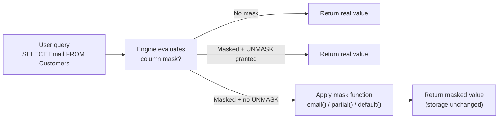
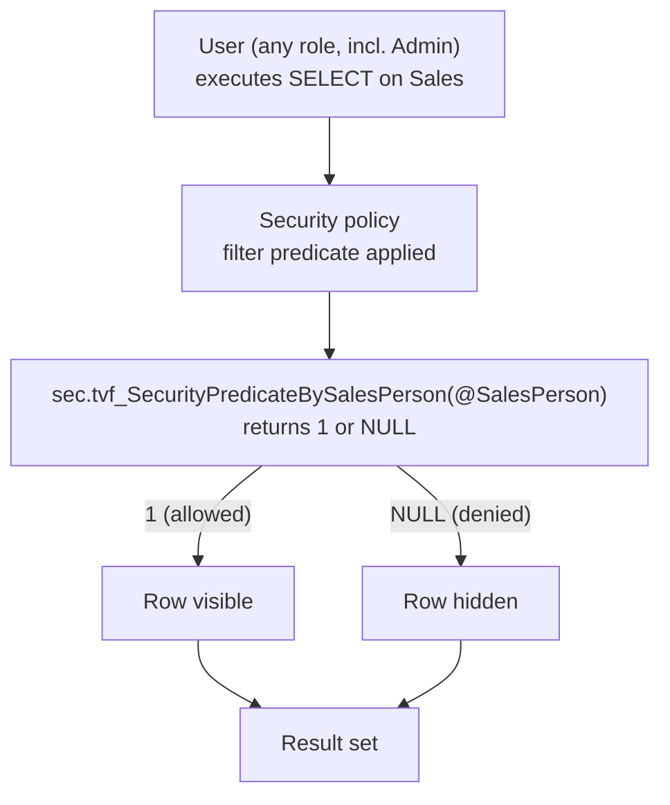
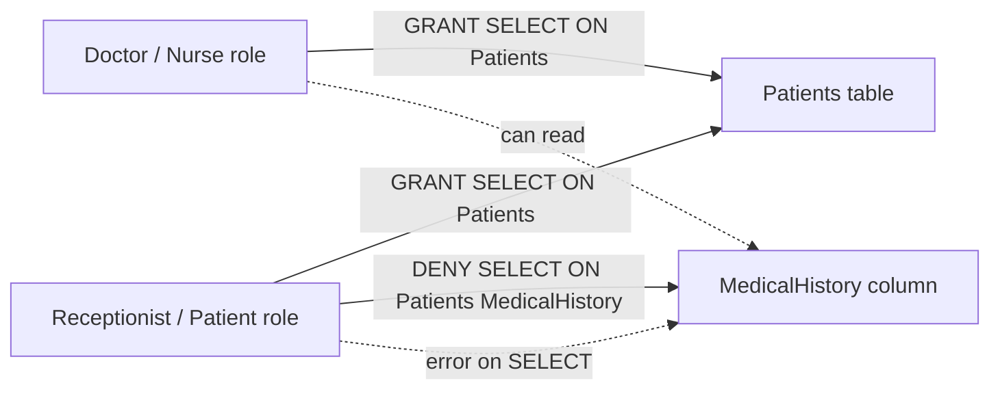

# Module Mind Map — Secure a Microsoft Fabric data warehouse

> [!info] Single-page overview
> This file mirrors the mind map in `[[_MOC]]` as a standalone Mermaid document. Open in Obsidian's Mermaid preview or paste into [Mermaid Live Editor](https://mermaid.live).

## 🗺️ Mind map

```mermaid
mindmap
  root((Secure a Microsoft Fabric<br/>data warehouse<br/>Path 5 / Module 2))
    Security layers
      Workspace roles
        Admin / Member / Contributor / Viewer
      Item permissions
        Share warehouse downstream
      Data protection
        DDM / RLS / CLS / SQL granular
        T-SQL driven
      Audit logs
        Purview + PowerShell
        Compliance reporting
      Encryption at rest
        Microsoft-managed by default
        CMK via Key Vault
    Dynamic Data Masking
      Query-time obfuscation
      No storage change
      No schema change
      Mask functions
        default()
        email()
        partial(prefix, padding, suffix)
        random(low, high)
      Apply
        ALTER TABLE ALTER COLUMN ADD MASKED WITH
        ALTER TABLE ALTER COLUMN DROP MASKED
      Permissions
        CONTROL = unmasked
        GRANT UNMASK per user
        ALTER ANY MASK for engineers
      Limitation
        Inference attacks
        Divide-by-zero signals
        One layer, not a wall
    Row-Level Security
      Filter predicate
        Inline table-valued function
        WITH SCHEMABINDING
        true / false per row
      Security policy
        Binds predicate to table
        STATE = ON / OFF
        Affects SELECT UPDATE DELETE
        INSERT NOT filtered
      Applies to ALL users
        Admins too
        Always add admin exception
      Side-channel attacks
        Divide-by-zero probes
        Combine with CLS + DDM
        Restrict ALTER ANY SECURITY POLICY
    Column-Level Security
      GRANT + DENY per column
      Roles
        Doctor / Nurse / Receptionist / Patient
      Errors look like missing column
      Power BI Direct Lake
        Falls back to Direct Query
        Security still enforced
        Performance trade-off
    SQL Granular Permissions
      GRANT DENY REVOKE
      DENY always wins
      Table / view
        SELECT INSERT UPDATE DELETE
      Function / proc
        EXECUTE ALTER CONTROL
      Least privilege
        EXECUTE on procs only
        DENY on underlying tables
        Revoke temp access
```

## 🔒 DDM query-time flow (auxiliary diagram)



## 🛡️ RLS predicate flow (auxiliary diagram)



## 📋 CLS GRANT + DENY pattern (auxiliary diagram)



## 🧭 Related

- [[_MOC]] — module index
- [[Unit-1-Introduction]] · [[Unit-2-Dynamic-Data-Masking]] · [[Unit-3-Row-Level-Security]] · [[Unit-4-Column-Level-Security]] · [[Unit-5-SQL-Granular-Permissions]] · [[Unit-6-Exercise]] · [[Unit-7-Knowledge-Check]] · [[Unit-8-Summary]]