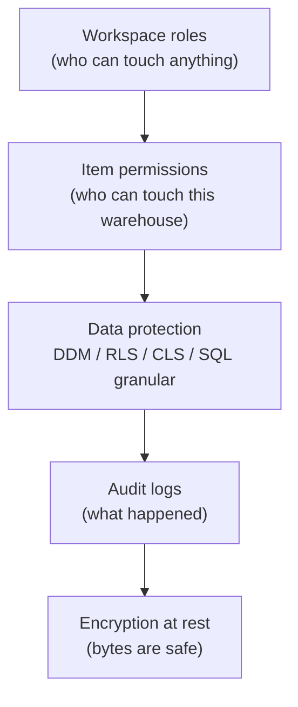
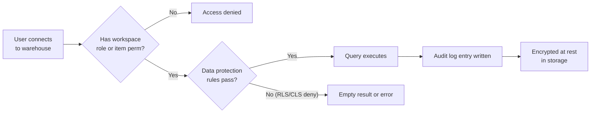

# Unit 1 — Introduction

## 🎯 Why this matters

When sensitive data lives in a Fabric warehouse, a **single access control isn't enough**. Different users need different levels of visibility — some should see a table but not a column; others should see only their own rows. Layered security lets you express those rules precisely. This module focuses on the **data protection** layer of that stack.

> [!info] The five security layers
> A Fabric warehouse protects data with **five complementary layers**. They are listed here from outermost (broadest) to innermost (most precise):
>
> | Layer | Where it acts | What it decides |
> |-------|---------------|----------------|
> | Workspace roles | Workspace | Who can access and manage items (Admin, Member, Contributor, Viewer) |
> | Item permissions | Warehouse item | Who can connect to this warehouse without granting workspace access |
> | **Data protection** | Warehouse objects | **Who sees what rows / columns — T-SQL driven (focus of this module)** |
> | Audit logs | Activity stream | What happened: logins, queries, permission changes (Purview + PowerShell) |
> | Encryption | Storage | Data at rest — Microsoft-managed keys by default; CMK via Key Vault |

> [!tip] Defense in depth
> None of these layers replaces the others. Production warehouses combine all five: workspace roles keep the wrong people out, item permissions share selectively, data protection enforces row/column rules, audit logs prove what happened, and encryption protects the bytes.

## 🔭 Workspace roles — the first line of control

The four built-in workspace roles decide who can use the workspace at all. They are evaluated **before** any warehouse query is allowed.

| Role | What it can do |
|------|----------------|
| **Admin** | Full control — manage the workspace, items, and members |
| **Member** | Create / edit items, share, manage permissions (less than Admin) |
| **Contributor** | Create / edit items, **read** warehouses; no sharing |
| **Viewer** | Read warehouse data; cannot create or modify items |

> [!warning] Workspace Admins see unmasked values
> Users with Admin/Member/Contributor permissions typically hold the `CONTROL` permission on the warehouse. `CONTROL` always sees data **without** masks applied (see [[Unit-2-Dynamic-Data-Masking]]). If you need a "super user" that still sees masked output, you must explicitly **not** grant them CONTROL.

## 🤝 Item permissions — share without workspace access

Item permissions let you grant access to a **single warehouse** without giving the recipient workspace membership. Use this when a downstream consumer only needs to query one warehouse (for example, a Power BI report owner loading data through a SQL connection).

> [!success] Typical pattern
> 1. Data team works in the workspace with full Admin/Member roles.
> 2. Reporting team receives **item-level** read access to a specific warehouse only.
> 3. Each layer is auditable independently.

## 🛡️ Data protection — the focus of this module

T-SQL gives you fine-grained control at the **object, column, and row** level — without requiring application changes. Four mechanisms:

- **Dynamic data masking (DDM)** — obscure column values in query results. → [[Unit-2-Dynamic-Data-Masking]]
- **Row-level security (RLS)** — filter which rows a user sees. → [[Unit-3-Row-Level-Security]]
- **Column-level security (CLS)** — restrict which columns a user can SELECT. → [[Unit-4-Column-Level-Security]]
- **SQL granular permissions** — `GRANT` / `DENY` / `REVOKE` on objects. → [[Unit-5-SQL-Granular-Permissions]]

## 📜 Audit logs — evidence

SQL audit logs capture **user activity**, including logins, queries, and permission changes. Audit data is available through:

- **Microsoft Purview** — central catalog and compliance hub.
- **PowerShell** — scripting and automation.

You can configure **event categories** and **retention policies**. Audit logs are essential for:

- Compliance reporting (SOC, ISO, HIPAA, etc.).
- Detecting unauthorized access.
- Forensics after a suspected incident.

> [!quote] Why audit logs matter
> "Logs you don't have are logs you can't show." Audit configuration should be in place **before** you need it, not after a security event.

## 🔐 Encryption — at rest by default

All warehouse data is encrypted at rest by default using **Microsoft-managed keys**. For greater control:

- Configure **customer-managed keys (CMK)** through **Azure Key Vault**.
- Rotate keys on your schedule.
- Revoke access to encrypted data by revoking the key — a powerful break-glass option.

> [!info] Encryption is invisible to queries
> Unlike DDM, encryption does not change **what users see in query results** — only what's on disk. The two controls are independent and complement each other.

## 🧭 Layered security in one picture

## 🔑 Key terms (flashcards)

- **Workspace role** — Admin / Member / Contributor / Viewer; decides who can touch the workspace at all.
- **Item permission** — grant access to one warehouse without workspace membership.
- **Data protection** — DDM / RLS / CLS / SQL granular permissions — T-SQL-driven fine-grained control.
- **Audit log** — record of who did what, surfaced through Purview + PowerShell.
- **Customer-managed key (CMK)** — encryption key you control through Azure Key Vault.
- **Defense in depth** — combining multiple independent security layers so a single failure doesn't expose data.

## 🧭 Next

→ [Unit 2 — Explore dynamic data masking](./Unit-2-Dynamic-Data-Masking.md)
↑ [_MOC](./_MOC.md)