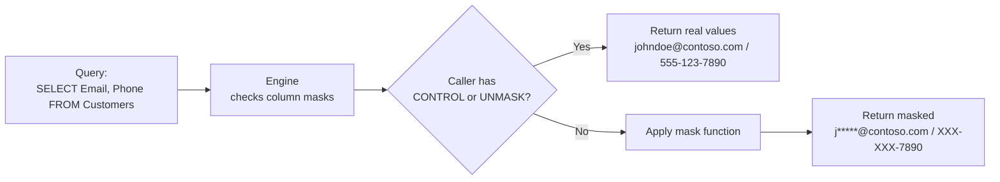
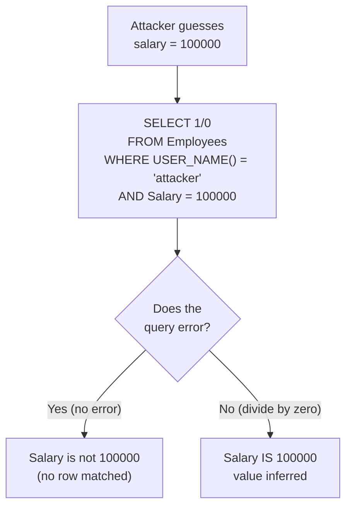
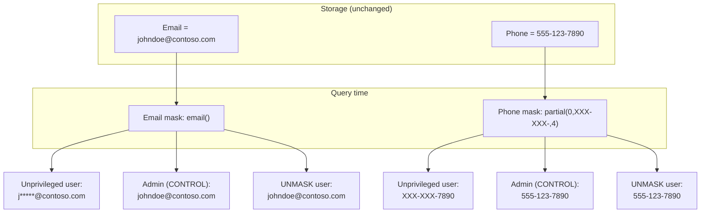

# Unit 2 — Explore dynamic data masking

## 🎯 Why this matters

Sensitive data in a warehouse — **email addresses, credit card numbers, salary figures** — shouldn't be visible to every user who has query access. **Dynamic data masking (DDM)** lets you obscure column values in query results **without changing the underlying data**. Nonprivileged users see a masked version; the actual values stay intact in storage.

Because masking happens at **query time**, not the storage layer, DDM is easy to add to an existing warehouse without schema changes or application modifications.

> [!info] Masking ≠ encryption
> DDM does **not** protect the bytes on disk. It only changes what users see in their query results. Anyone who can read the file directly (e.g., a Fabric Admin exporting raw storage) can still see the unmasked values. Combine DDM with encryption-at-rest for true confidentiality.

## 🎭 The four masking functions

Fabric warehouses support four masking types. Rules are defined **at the column level**.

| Masking type | What it shows | Masking rule |
|--------------|---------------|--------------|
| **Default** | Fully replaces the value based on the data type — numbers become `0`, strings become `XXXX`, dates become `1900-01-01`. | `default()` |
| **Email** | Shows the first character and appends a fixed `.com` suffix. For example, `johndoe@contoso.com` becomes `j*****@contoso.com`. | `email()` |
| **Custom text** | Exposes a specified number of characters at the start and end, with custom padding in between. Useful for partial identifiers like the last four digits of a credit card. | `partial(prefix, padding, suffix)` |
| **Random** | Replaces numeric or binary values with a random number within a specified range. | `random(low, high)` |

> [!tip] `partial()` signature
> The three arguments of `partial()` are **exposed prefix length**, **padding string**, and **exposed suffix length**. For "last four only" with dashes: `partial(0, "XXX-XXX-", 4)` — exposes the last 4 chars after a dashed padding.

## ⚙️ Configure data masking

To apply masks to columns in a `Customers` table, use `ALTER TABLE ... ALTER COLUMN ... ADD MASKED WITH`:

```sql
-- Mask the email address
ALTER TABLE Customers
ALTER COLUMN Email ADD MASKED WITH (FUNCTION = 'email()');

-- Show only the last four digits of the phone number
ALTER TABLE Customers
ALTER COLUMN PhoneNumber ADD MASKED WITH (FUNCTION = 'partial(0,"XXX-XXX-",4)');

-- Show only the last four digits of the credit card number
ALTER TABLE Customers
ALTER COLUMN CreditCardNumber ADD MASKED WITH (FUNCTION = 'partial(0,"XXXX-XXXX-XXXX-",4)');
```

To remove a mask:

```sql
ALTER TABLE Customers
ALTER COLUMN Email DROP MASKED;
```

## 👁️ What masked output looks like

Once masks are in place, a nonprivileged user querying the `Customers` table sees masked output:

```
CustomerName: John Doe
Email: j*****@contoso.com
PhoneNumber: XXX-XXX-7890
CreditCardNumber: XXXX-XXXX-XXXX-3456
```

Users with the `CONTROL` permission — **Admins, Members, and Contributors** — always see the unmasked values.



## 🔑 Manage masking permissions

By default, only users with the `CONTROL` permission (Admins, Members, Contributors) can view unmasked data. To allow a **specific non-admin** user to see unmasked values, grant them the `UNMASK` permission:

```sql
-- Grant a specific user the ability to see unmasked data
GRANT UNMASK ON dbo.Customers TO [user@contoso.com];
```

To **add or remove** masks from columns, a user needs the `ALTER ANY MASK` permission:

```sql
-- Allow a data engineer to manage masking rules without granting admin rights
GRANT ALTER ANY MASK TO [engineer@contoso.com];
```

To **revoke** access to unmasked data:

```sql
REVOKE UNMASK ON dbo.Customers FROM [user@contoso.com];
```

The `UNMASK` permission gives you fine-grained control over who sees real data — without requiring you to grant full admin or table ownership rights.

> [!success] Three permissions, three jobs
>
> | Permission | Lets the grantee… |
> |------------|-------------------|
> | `CONTROL` | (Admins/Members/Contributors) See unmasked values, manage everything |
> | `UNMASK` | See unmasked values for specific tables/views |
> | `ALTER ANY MASK` | Add or remove mask definitions on columns |

## ⚠️ Inference attacks — the real limitation

> [!warning] DDM hides values — it doesn't prevent querying
> Unprivileged users with query permissions can **infer** the actual data since the data isn't physically obscured. For example, a user could write a query that divides by a masked salary column and triggers a divide-by-zero error **only when** the hidden value matches their guess — revealing the actual data without ever seeing it directly.



**Mitigations:**

- Combine DDM with [[Unit-3-Row-Level-Security]] to deny the attacker access to the predicate column at all.
- Restrict who can `SELECT` from sensitive tables.
- Audit queries — repeated divide-by-zero errors are a red flag.
- Restrict `ALTER ANY MASK` to trusted users only.

> [!tip] One layer, not a wall
> DDM is one layer of protection, not your only control. Stack it with RLS, CLS, and least-privilege `GRANT`/`DENY` for real defense.

## 📋 DDM in one picture



## 🔑 Key terms (flashcards)

- **Dynamic data masking (DDM)** — query-time obfuscation of column values; storage is unchanged.
- **`default()`** — replaces a value with a type-appropriate placeholder (`0`, `XXXX`, `1900-01-01`).
- **`email()`** — exposes the first character + `*****@contoso.com`.
- **`partial(prefix, padding, suffix)`** — exposes a fixed prefix and suffix with custom padding.
- **`random(low, high)`** — replaces a numeric/binary value with a random number in range.
- **`UNMASK`** — permission that overrides masks for a specific table/view.
- **`ALTER ANY MASK`** — permission that lets a non-admin add/remove mask definitions.
- **Inference attack** — deducing a masked value through query side-effects (e.g., divide-by-zero probes).

## 🧭 Next

→ [Unit 3 — Implement row-level security](./Unit-3-Row-Level-Security.md)
← [Unit 1 — Introduction](./Unit-1-Introduction.md)
↑ [_MOC](./_MOC.md)