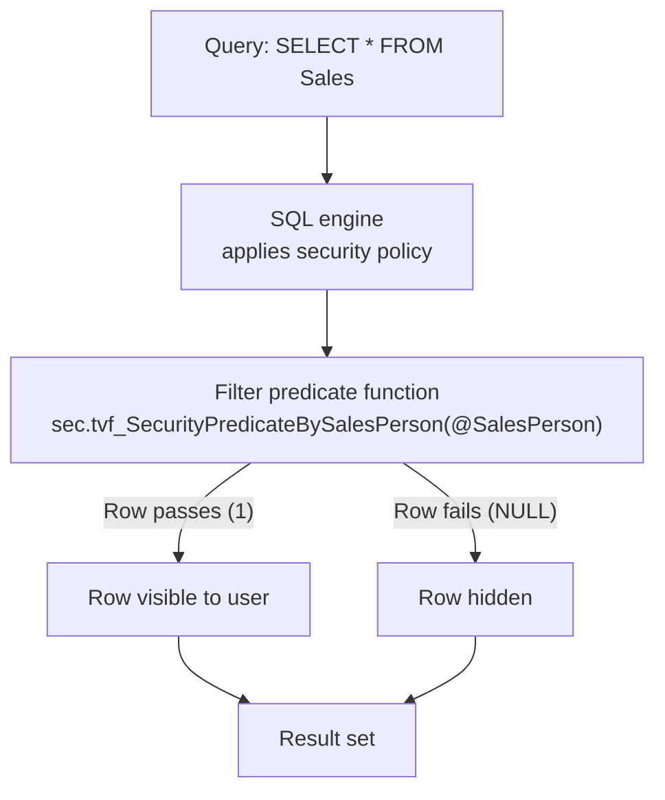
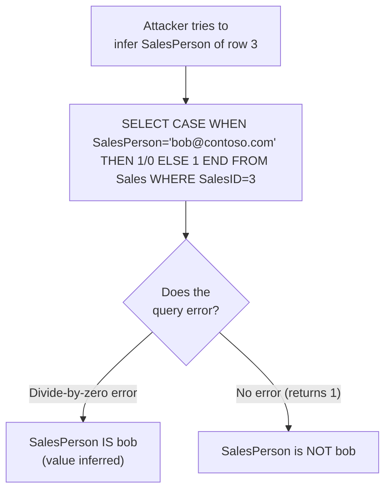

# Unit 3 — Implement row-level security

## 🎯 Why this matters

**Row-level security (RLS)** controls which rows a user can see in a table — automatically and transparently, **without changing application queries**. Rather than filtering results in your application layer, you define a **security predicate** in the database and the SQL engine enforces it for every query against that table.

> [!info] A classic scenario
> In a shared `Sales` table, you might use RLS so that each salesperson sees **only their own orders**. They query the same table as everyone else, but get results scoped to their data. The application doesn't change.

## ⚙️ How row-level security works

RLS uses two components that work together:

- **Filter predicate** — An inline table-valued function that evaluates each row and returns `true` or `false`. Rows where the predicate returns `false` are **invisible** to the user for `SELECT`, `UPDATE`, and `DELETE` operations. **`INSERT` isn't affected by filter predicates.**
- **Security policy** — A policy that binds one or more filter predicates to specific tables. When a query runs against a secured table, the policy applies the predicate automatically.



> [!tip] Invisible, not flagged
> Filtered rows aren't returned and don't appear as errors — they simply don't exist in the user's result. This is what makes RLS transparent to applications.

## 🛠️ Configure row-level security — full walkthrough

The following example sets up RLS so that each salesperson in a shared `Sales` table sees only their own rows.

### Step 1 — Create the table and add test data

```sql
CREATE TABLE [Sales] (
    SalesID INT,
    ProductID INT,
    SalesPerson NVARCHAR(50),
    OrderQty INT,
    UnitPrice MONEY
);

INSERT INTO [Sales] VALUES (1, 3, 'alice@contoso.com', 5, 10.00);
INSERT INTO [Sales] VALUES (2, 4, 'alice@contoso.com', 2, 57.00);
INSERT INTO [Sales] VALUES (3, 7, 'bob@contoso.com',   4, 23.00);
INSERT INTO [Sales] VALUES (4, 2, 'bob@contoso.com',   2, 91.00);
INSERT INTO [Sales] VALUES (5, 9, 'carol@contoso.com', 5, 80.00);
```

### Step 2 — Create a dedicated schema, define the predicate, apply the policy

> [!tip] Why a separate schema?
> Place security objects (functions, policies) in their own schema. This keeps security logic discoverable, easy to audit, and avoids name collisions with business objects.

```sql
-- Create a schema for security objects
CREATE SCHEMA [Sec];
GO

-- Define the filter predicate
CREATE FUNCTION sec.tvf_SecurityPredicateBySalesPerson(@SalesPerson AS NVARCHAR(50))
    RETURNS TABLE
WITH SCHEMABINDING
AS
    RETURN SELECT 1 AS result
           WHERE @SalesPerson = USER_NAME()
              OR USER_NAME() = 'salesadmin@contoso.com';
GO

-- Apply the policy to the Sales table
CREATE SECURITY POLICY sec.SalesPolicy
ADD FILTER PREDICATE sec.tvf_SecurityPredicateBySalesPerson(SalesPerson) ON [dbo].[Sales]
WITH (STATE = ON);
GO
```

With this policy active:

| User | Rows visible |
|------|--------------|
| `alice@contoso.com` | Only the 2 rows where `SalesPerson = 'alice@contoso.com'` |
| `bob@contoso.com`   | Only the 2 rows where `SalesPerson = 'bob@contoso.com'` |
| `carol@contoso.com` | Only the 1 row where `SalesPerson = 'carol@contoso.com'` |
| `salesadmin@contoso.com` | **All 5 rows** (explicit OR clause) |

To disable the policy temporarily:

```sql
ALTER SECURITY POLICY sec.SalesPolicy WITH (STATE = OFF);
```

> [!warning] `WITH SCHEMABINDING` is required
> The filter predicate function **must** be created `WITH SCHEMABINDING`. This binds the function to the schema objects it references so they can't be altered in a way that breaks the predicate. Without it, the `CREATE SECURITY POLICY` statement fails.

## 🔐 Security considerations

### RLS applies to admins too

RLS applies security predicates to **all users** — including workspace **Admins, Members, and Contributors**. If a predicate isn't written to explicitly include admin-level users, those users will have rows filtered from their results just like any other user.

> [!important] Always include an admin exception
> Write your predicate to include an **explicit condition** for admin access if full visibility is required. The example above uses `OR USER_NAME() = 'salesadmin@contoso.com'` — without this clause, the sales admin would see an empty result.

```sql
-- Good: explicit admin exception
WHERE @SalesPerson = USER_NAME()
   OR USER_NAME() = 'salesadmin@contoso.com'

-- Bad: admins see no rows
WHERE @SalesPerson = USER_NAME()
```

### Side-channel attacks

RLS is vulnerable to **side-channel attacks**, where a carefully crafted query reveals the values of filtered rows without the user ever directly reading them.



**Example probe query** — the attacker writes:

```sql
-- If this throws a divide-by-zero error, the hidden row exists
SELECT 1/0 FROM Sales WHERE SalesPerson = 'bob@contoso.com';
```

A divide-by-zero error means a row matched; no error (or empty result) means it didn't. The attacker never reads the row — but they learn whether it exists.

> [!tip] Reduce side-channel risk
> - **Combine RLS with [[Unit-4-Column-Level-Security]]** to remove the columns the attacker needs to construct probes.
> - **Add [[Unit-2-Dynamic-Data-Masking]]** so that even if a row leaks, sensitive fields are obscured.
> - **Monitor** for repeated divide-by-zero errors and other anomalous queries.
> - **Restrict `ALTER ANY SECURITY POLICY`** to trusted users only — anyone with this permission can disable your predicate.

## 🧠 What RLS doesn't filter

> [!warning] `INSERT` is not affected
> The filter predicate applies to `SELECT`, `UPDATE`, and `DELETE`. **An `INSERT` always succeeds** as long as the user has `INSERT` permission — the new row can reference values that the predicate would otherwise hide. If you need to block inserts that don't match the predicate, write a `CHECK` constraint or a trigger, or use a `BLOCK PREDICATE` (not covered in this module).

| Statement | Filtered by predicate? |
|-----------|------------------------|
| `SELECT`  | ✅ Yes |
| `UPDATE`  | ✅ Yes |
| `DELETE`  | ✅ Yes |
| `INSERT`  | ❌ No — predicate does not run |

## 🔑 Key terms (flashcards)

- **Row-level security (RLS)** — restricts which rows a user can see; enforced by the SQL engine.
- **Filter predicate** — inline table-valued function returning `1` (allow) or NULL (deny) per row.
- **Security policy** — binds one or more predicates to tables; can be enabled/disabled with `STATE = ON/OFF`.
- **`SCHEMABINDING`** — required option on the predicate function; prevents breaking schema changes.
- **`USER_NAME()`** — T-SQL function returning the current connection's user/principal name.
- **Side-channel attack** — inferring protected values through query side-effects (divide-by-zero probes, timing, error patterns).
- **`ALTER ANY SECURITY POLICY`** — sensitive permission that lets a user enable/disable any policy.

## 🧭 Next

→ [Unit 4 — Implement column-level security](./Unit-4-Column-Level-Security.md)
← [Unit 2 — Explore dynamic data masking](./Unit-2-Dynamic-Data-Masking.md)
↑ [_MOC](./_MOC.md)