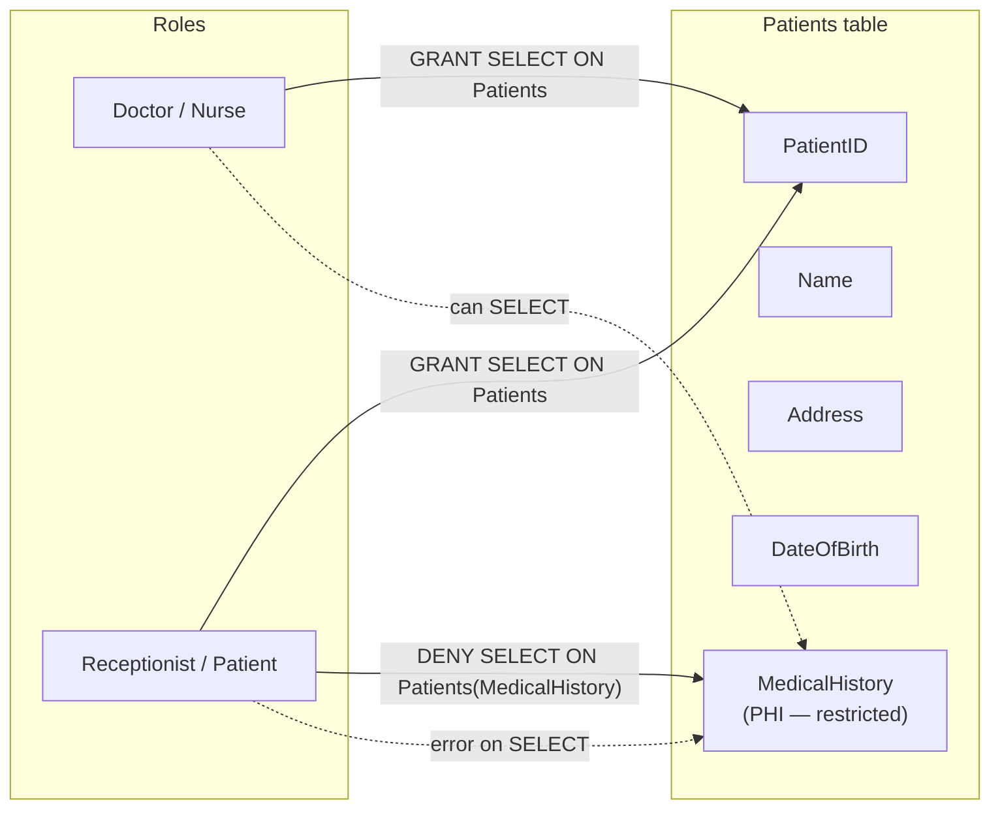
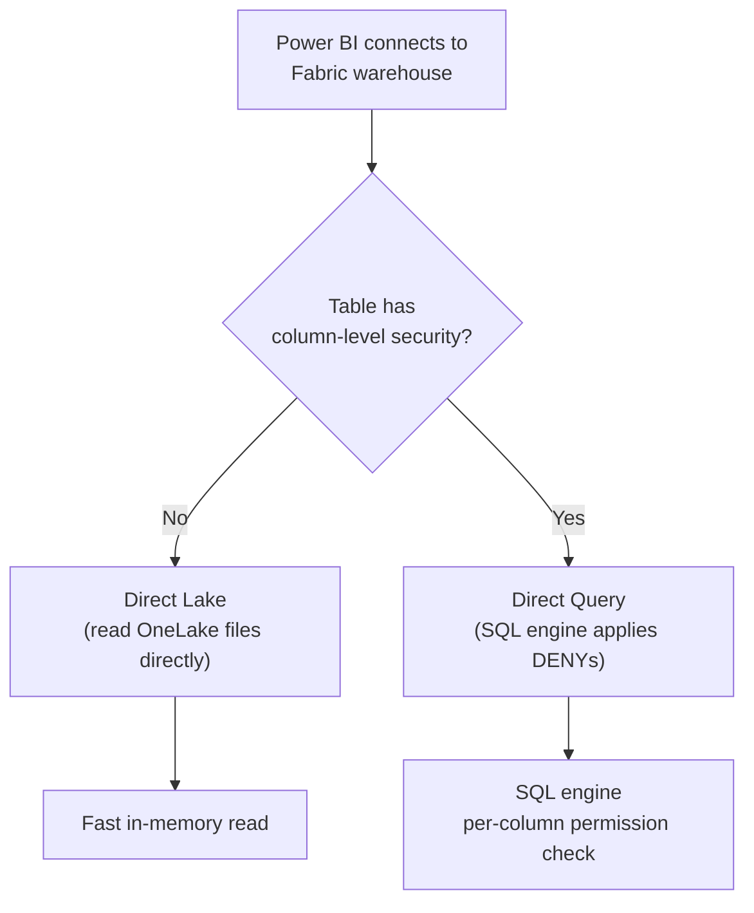

# Unit 4 — Implement column-level security

## 🎯 Why this matters

**Column-level security (CLS)** lets you restrict access to specific columns in a table **without changing its structure**. Users without permission to a column receive an **error** if they try to select it — and the rest of the table remains accessible to them normally. This makes CLS a clean solution for protecting sensitive fields in shared tables.

> [!info] CLS vs DDM
> - **CLS** — the user **cannot SELECT** the column. Querying it fails.
> - **DDM** ([[Unit-2-Dynamic-Data-Masking]]) — the user **can SELECT** the column but sees a masked value.
> Use CLS when the column should be invisible; use DDM when partial visibility (e.g., last four of a credit card) is acceptable.

## 🏥 A practical scenario

Consider a **healthcare database** with a `Patients` table:

| Column | Sensitivity |
|--------|-------------|
| `PatientID` | Identifier — generally accessible |
| `Name` | PII — generally accessible |
| `Address` | PII — generally accessible |
| `DateOfBirth` | PII — generally accessible |
| `MedicalHistory` | **PHI** — clinical staff only |

The `MedicalHistory` column contains **protected health information (PHI)** that only clinical staff should access.

With column-level security, you define this access boundary directly in the warehouse using four steps:

1. **Identify sensitive columns** — Determine which columns contain data that requires restricted access.
2. **Define roles** — Create roles that reflect job functions: `Doctor`, `Nurse`, `Receptionist`, and `Patient`.
3. **Assign users to roles** — Map each user to the role that matches their job.
4. **Apply `GRANT` and `DENY`** — Grant broad table access, then explicitly deny access to the sensitive column for roles that shouldn't see it.



## ⚙️ Configure column-level security

The following T-SQL creates roles, grants table access, then denies access to `MedicalHistory` for roles that shouldn't see it:

```sql
-- Create roles
CREATE ROLE Doctor AUTHORIZATION dbo;
CREATE ROLE Nurse AUTHORIZATION dbo;
CREATE ROLE Receptionist AUTHORIZATION dbo;
CREATE ROLE Patient AUTHORIZATION dbo;
GO

-- Grant SELECT on all columns to all roles
GRANT SELECT ON dbo.Patients TO Doctor;
GRANT SELECT ON dbo.Patients TO Nurse;
GRANT SELECT ON dbo.Patients TO Receptionist;
GRANT SELECT ON dbo.Patients TO Patient;
GO

-- Deny SELECT on MedicalHistory to roles that shouldn't see it
DENY SELECT ON dbo.Patients (MedicalHistory) TO Receptionist;
DENY SELECT ON dbo.Patients (MedicalHistory) TO Patient;
GO
```

### How it behaves at query time

| Role | `SELECT PatientID, Name, DOB FROM Patients` | `SELECT MedicalHistory FROM Patients` |
|------|---------------------------------------------|----------------------------------------|
| Doctor | ✅ Returns all rows | ✅ Returns all rows |
| Nurse | ✅ Returns all rows | ✅ Returns all rows |
| Receptionist | ✅ Returns all rows | ❌ **Permission error** |
| Patient | ✅ Returns all rows | ❌ **Permission error** |

> [!warning] DENY trumps GRANT
> Remember the rule from [[Unit-5-SQL-Granular-Permissions|Unit 5]]: when a user has both `GRANT` and `DENY` on the same permission — from different roles, for example — `DENY` always wins. The `GRANT SELECT ON dbo.Patients` grants access to the table as a whole; the `DENY SELECT ON dbo.Patients (MedicalHistory)` narrows it to a specific column.

## 🔌 Power BI Direct Lake interaction

> [!important] Direct Lake → Direct Query fallback
> When Power BI accesses a warehouse in **Direct Lake** mode and a table has column-level security applied, queries automatically **fall back to Direct Query** mode. Security is still enforced, but query performance differs from the Direct Lake baseline.

| Scenario | Mode used | Reason |
|----------|-----------|--------|
| No CLS applied to the table | **Direct Lake** | Default fast path — files read directly from OneLake |
| CLS applied to the table | **Direct Query** (fallback) | Engine enforces per-column DENYs at query time |
| CLS applied but user queries only allowed columns | **Direct Query** | Mode is determined by the **table's CLS state**, not the column being queried |



> [!tip] Plan for performance
> If you're designing a Power BI semantic model on top of a Fabric warehouse and rely on Direct Lake for performance, be aware that **adding CLS to any table in the model switches that table to Direct Query**. Use CLS only where required.

## 🎯 When to use each data-protection mechanism

| Need | Use |
|------|-----|
| Hide column from certain roles entirely | **CLS** — `DENY SELECT` on the column |
| Show column with masked values to certain users | **DDM** — `ALTER TABLE ... ADD MASKED WITH` |
| Restrict which rows a role sees | **RLS** — predicate function + security policy |
| Restrict which objects a role can access | **SQL granular permissions** — `GRANT` / `DENY` on objects |

In practice you **stack** them: e.g., a finance team might have **RLS** scoping them to their region's rows, **CLS** denying them the `Salary` column of an HR table, **DDM** showing only the last four digits of credit-card numbers, and **least-privilege** SQL grants that prevent them from running ad-hoc `DELETE`s.

## 🔑 Key terms (flashcards)

- **Column-level security (CLS)** — `GRANT` on the table combined with `DENY` on specific columns.
- **Role** — a database principal you `GRANT` / `DENY` to; users are added to roles with `ALTER ROLE ... ADD MEMBER`.
- **Direct Lake** — Power BI mode that reads OneLake files directly for fast performance.
- **Direct Query** — Power BI mode that translates visuals to SQL at query time; required when CLS is applied.
- **PHI (Protected Health Information)** — clinical data subject to healthcare privacy regulations.
- **DENY trumps GRANT** — a `DENY` on a column always wins over a table-level `GRANT SELECT`.

## 🧭 Next

→ [Unit 5 — Configure SQL granular permissions using T-SQL](./Unit-5-SQL-Granular-Permissions.md)
← [Unit 3 — Implement row-level security](./Unit-3-Row-Level-Security.md)
↑ [_MOC](./_MOC.md)