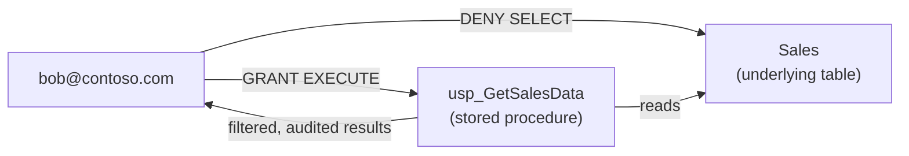
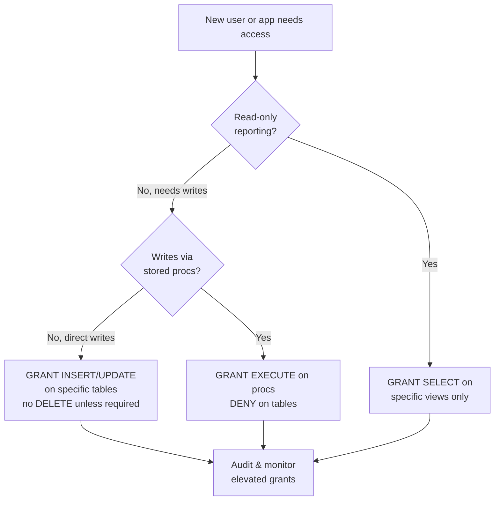

# Unit 5 — Configure SQL granular permissions using T-SQL

## 🎯 Why this matters

**Workspace roles** and **item permissions** control broad access to a Fabric warehouse. For production environments, you often need finer control — restricting which users can read specific tables, insert rows into specific objects, or execute specific stored procedures. **SQL granular permissions** give you that precision.

Fabric warehouses support the standard SQL `GRANT`, `DENY`, and `REVOKE` statements. When a user has both a `GRANT` and a `DENY` on the same permission — from different roles, for example — **`DENY` always wins**.

> [!important] DENY always wins
> Whether the conflict comes from role membership, multiple explicit statements, or inherited permissions — `DENY` trumps everything. Use it sparingly but deliberately: a `DENY` is a hard wall.

## 🗃️ Table and view permissions

The four core data manipulation permissions apply to tables and views:

| Permission | What it allows |
|------------|----------------|
| `SELECT` | Read data from the object. |
| `INSERT` | Add new rows to the object. |
| `UPDATE` | Modify existing rows in the object. |
| `DELETE` | Remove rows from the object. |

```sql
GRANT SELECT ON dbo.SalesReport TO [alice@contoso.com];
DENY  SELECT ON dbo.Payroll      TO [alice@contoso.com];
```

Within a table or view, you can also apply these permissions at the **column level**, which pairs naturally with [[Unit-4-Column-Level-Security|column-level security]].

## ⚙️ Function and stored procedure permissions

Functions and stored procedures have their own permission set:

| Permission | What it allows |
|------------|----------------|
| `EXECUTE` | Run the function or stored procedure. |
| `ALTER`   | Modify the definition of the object. |
| `CONTROL` | Full ownership-level rights over the object. |

```sql
GRANT EXECUTE ON dbo.usp_GetSalesData TO [bob@contoso.com];
DENY  SELECT  ON dbo.Sales             TO [bob@contoso.com];
```

In many warehouse architectures, users interact with data only through **stored procedures**, not directly with tables. Granting `EXECUTE` on procedures while denying direct table access is an effective way to enforce a controlled data access pattern.



> [!success] Why `EXECUTE`-only is a great pattern
> - The procedure can **filter**, **mask**, or **log** — none of which `SELECT` from the table directly would do.
> - Users can't run `DELETE Sales` because they have no permission on the table at all.
> - **Schema changes** to the table don't break user access — the procedure abstracts the table.
> - **Auditing** is centralized in the procedure body.

## 🔑 Apply the principle of least privilege

Give each user or application only the permissions it needs to do its job — **nothing more**. In practice:

- An application that reads data through stored procedures should have **`EXECUTE` permission on those procedures, not `SELECT` on the underlying tables**.
- A reporting role that only needs to read data should have **`SELECT` on specific views, not broad table access**.
- **Temporary elevated access** should be revoked once the task is complete.

This approach limits the impact if a credential is compromised or a user accidentally runs a destructive query.



## 📋 When to use each permission type

| Need | Grant this | Consider denying |
|------|------------|------------------|
| Reporting user reads data | `SELECT` on specific views | `SELECT` on underlying tables |
| ETL job loads data | `INSERT` (or `EXECUTE` on a load proc) on staging tables | `DELETE` on production tables |
| Analyst fixes a few rows | `UPDATE` on specific columns | `UPDATE` everywhere |
| App calls stored procedures | `EXECUTE` on the procedures | Table-level `SELECT`/`INSERT`/`UPDATE`/`DELETE` |
| Service principal automates a workflow | `EXECUTE` on the workflow proc only | All other object access |

> [!warning] Don't grant `CONTROL` casually
> `CONTROL` is ownership-level — it overrides [[Unit-2-Dynamic-Data-Masking|DDM]] (the user sees unmasked values) and can grant itself more permissions. Reserve `CONTROL` for Admins/Members/Contributors who own the warehouse.

## 🛠️ Common patterns (cookbook)

### Pattern 1 — `EXECUTE`-only via procedures

```sql
-- App gets only what it needs
GRANT EXECUTE ON dbo.usp_GetSalesByRegion TO [reporting_app@contoso.com];
DENY  SELECT   ON dbo.Sales               TO [reporting_app@contoso.com];
```

### Pattern 2 — read-only analyst on a view

```sql
CREATE VIEW dbo.vw_SalesSummary AS
    SELECT SalesPerson, SUM(OrderQty * UnitPrice) AS Revenue
    FROM dbo.Sales
    GROUP BY SalesPerson;

GRANT SELECT ON dbo.vw_SalesSummary TO [analyst@contoso.com];
DENY  SELECT ON dbo.Sales           TO [analyst@contoso.com];
```

### Pattern 3 — column-scoped SELECT

```sql
GRANT SELECT ON dbo.Customers (CustomerID, CustomerName, Email) TO [support@contoso.com];
DENY  SELECT ON dbo.Customers (CreditCardNumber)                 TO [support@contoso.com];
```

### Pattern 4 — temporary elevation, then revoked

```sql
-- Grant
GRANT DELETE ON dbo.Staging TO [engineer@contoso.com];

-- ... engineer does the cleanup ...

-- Revoke
REVOKE DELETE ON dbo.Staging FROM [engineer@contoso.com];
```

> [!tip] Always pair `GRANT` with a `DENY` or `REVOKE` plan
> Temporary grants grow stale. Document who needs what, grant narrowly, and **schedule the revoke** (calendar reminder, runbook step, or automation).

## 🔑 Key terms (flashcards)

- **SQL granular permissions** — `GRANT` / `DENY` / `REVOKE` on individual warehouse objects.
- **`GRANT`** — gives a permission to a principal.
- **`DENY`** — explicitly forbids a permission; always wins over `GRANT`.
- **`REVOKE`** — removes a previously granted permission; cancels a prior `GRANT`/`DENY`.
- **`EXECUTE`** — permission to run a function or stored procedure.
- **`CONTROL`** — ownership-level permission; bypasses DDM and can self-grant.
- **Least privilege** — give each principal only the permissions it needs.
- **EXECUTE-only pattern** — grant `EXECUTE` on procedures, deny table access — centralizes filtering, masking, and auditing.

## 🧭 Next

→ [Unit 6 — Exercise: Secure a warehouse in Microsoft Fabric](./Unit-6-Exercise.md)
← [Unit 4 — Implement column-level security](./Unit-4-Column-Level-Security.md)
↑ [_MOC](./_MOC.md)