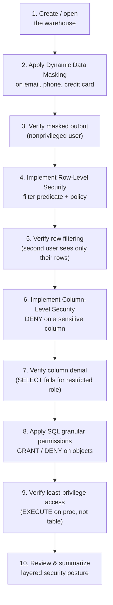

# Unit 6 — Exercise: Secure a warehouse in Microsoft Fabric

## 🎯 Lab summary

> [!warning] Requires Fabric capacity
> You need access to a **Fabric paid or trial capacity** to complete this exercise. See [Fabric trial](https://learn.microsoft.com/en-us/fabric/get-started/fabric-trial) for information about the free trial.

> [!info] What you'll do
> In this 45-minute hands-on lab, you secure a Fabric warehouse using all four data-protection mechanisms covered in this module: **dynamic data masking (DDM)**, **row-level security (RLS)**, **column-level security (CLS)**, and **SQL granular permissions**. You'll verify each control from a second user account to prove the rules fire end-to-end.

## 🧭 Lab flow (what the lab walks you through)

## 📚 Skills you'll exercise

| Skill | Where it appears | Reference unit |
|-------|------------------|----------------|
| Define masking rules | Step 2 — `ALTER TABLE ... ADD MASKED WITH` | [[Unit-2-Dynamic-Data-Masking]] |
| Grant `UNMASK` to specific users | Step 3 — verify masking fires | [[Unit-2-Dynamic-Data-Masking]] |
| Build a filter predicate (inline TVF, `WITH SCHEMABINDING`) | Step 4 — predicate function | [[Unit-3-Row-Level-Security]] |
| `CREATE SECURITY POLICY` with `STATE = ON` | Step 4 — bind predicate to table | [[Unit-3-Row-Level-Security]] |
| Verify predicate applies even to admins | Step 5 — admin exception | [[Unit-3-Row-Level-Security]] |
| `CREATE ROLE` + `GRANT SELECT` + `DENY SELECT (col)` | Step 6 — CLS pattern | [[Unit-4-Column-Level-Security]] |
| `GRANT` / `DENY` / `REVOKE` on tables, views, procedures | Step 8 — granular permissions | [[Unit-5-SQL-Granular-Permissions]] |
| Test as a second user | Steps 3, 5, 7, 9 — end-to-end verification | All units |

## 👥 Create a second user account for testing

Some steps require a second **Microsoft Entra user** to test access controls. Here's how to create one based on your situation.

> [!info] Two scenarios
> **If you're part of an organization with an Entra or Microsoft 365 tenant:**
> Work with your identity administrator to create the second user in [Entra](https://entra.microsoft.com/) or the [Microsoft 365 admin center](https://admin.cloud.microsoft/).
>
> **If you're not part of an organization tenant:**
> 1. Sign up for a [Microsoft 365 trial](https://learn.microsoft.com/en-us/power-bi/enterprise/service-admin-signing-up-for-power-bi-with-a-new-office-365-trial). This creates a new tenant where you're the admin.
> 2. Create a second user in the [Microsoft 365 admin center](https://admin.cloud.microsoft/#/users?azure-portal=true). See [Add users](https://learn.microsoft.com/en-us/microsoft-365/admin/add-users/add-users) for instructions.
> 3. Enable the Fabric trial using [Getting started with Fabric](https://learn.microsoft.com/en-us/fabric/get-started/fabric-trial).

> [!tip] Optional second user
> This exercise includes optional steps that use a second user account to verify that security controls are working. **If you can't create a second account, you can still complete the exercise** — screenshots at the end of each section show the expected results.

## 🔍 What "verification" looks like

| Control | Without second user (read code) | With second user (empirical) |
|---------|----------------------------------|------------------------------|
| DDM | `SELECT` shows masked values like `j*****@contoso.com` | Sign in as second user, run the same `SELECT` — confirm the masked string |
| RLS | `alice@contoso.com` predicate returns only Alice's rows | Sign in as a user with `SalesPerson = 'bob@…'` — confirm only Bob's rows |
| CLS | `SELECT SensitiveCol` fails for `Receptionist` role | Sign in as the receptionist — confirm the error |
| SQL granular | `EXECUTE` on proc works, `SELECT` on table fails | Sign in as the app principal — confirm the proc succeeds, the table fails |

## 🔗 Launch

- Launch the exercise from the Microsoft Learn page: <https://learn.microsoft.com/en-us/training/modules/secure-data-warehouse-in-microsoft-fabric/6-exercise-secure-data-warehouse>
- Direct lab link: <https://go.microsoft.com/fwlink/?linkid=2277744>

> [!quote] From the source
> "You need access to a Fabric paid or trial capacity to complete this exercise."

## 🧭 Next

→ [Unit 7 — Knowledge check](./Unit-7-Knowledge-Check.md)
← [Unit 5 — Configure SQL granular permissions using T-SQL](./Unit-5-SQL-Granular-Permissions.md)
↑ [_MOC](./_MOC.md)