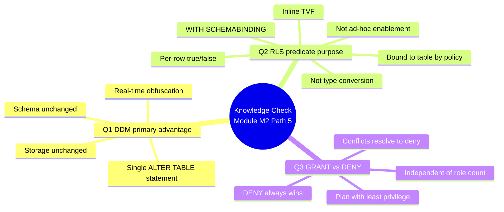

# Unit 7 — Knowledge check

> [!warning] Answer provenance
> Microsoft Learn intentionally does **not** publish the correct answers for knowledge-check questions. The answers below are **derived from the unit content** and the wording of each question. Treat them as best-effort study notes — verify against the live module if you fail the check.

## 📋 Questions

### Question 1

> What is the primary advantage of Dynamic Data Masking (DDM)?

- It limits data exposure by obscuring sensitive information in real time.
- It changes the actual data in the database.
- It requires complex coding to implement.

### Question 2

> What is the purpose of a security predicate function in Row-Level Security (RLS)?

- It determines whether a row is accessible to a user based on certain conditions.
- It enables type conversions in predicate functions.
- It allows users to run ad hoc queries.

### Question 3

> What happens when a user is granted a permission and then denied the same permission in a warehouse?

- The `GRANT` statement supersedes the `DENY`, and the user will have access to the specific object.
- The `DENY` always supersedes the `GRANT`, and the user is denied access to the specific object.
- The user has both permissions, and it causes a conflict.

## ✅ Answer key (derived)

| # | Correct answer | Why the others are wrong | Source unit |
|---|----------------|--------------------------|-------------|
| 1 | **It limits data exposure by obscuring sensitive information in real time.** | DDM does **not** change the stored data — masking happens at query time only. It does **not** require complex coding — it's a single `ALTER TABLE ... ADD MASKED WITH` statement. | [[Unit-2-Dynamic-Data-Masking]] |
| 2 | **It determines whether a row is accessible to a user based on certain conditions.** | The predicate is not about type conversions — it's an inline table-valued function returning `1` (allow) or NULL (deny). It does not enable ad-hoc queries; it **filters** them automatically. | [[Unit-3-Row-Level-Security]] |
| 3 | **The `DENY` always supersedes the `GRANT`, and the user is denied access.** | SQL Server / Fabric warehouses resolve `GRANT`/`DENY` conflicts in favor of `DENY` regardless of role membership. The two permissions don't "stack" — the more restrictive one wins. | [[Unit-5-SQL-Granular-Permissions]] |

## 🧠 Why these answers (linking back to the module)

## 🎯 Re-study pointers

> [!tip] If you missed a question, re-read:
> - Q1 → "Masking happens at query time, not at the storage layer" + the four mask functions in [[Unit-2-Dynamic-Data-Masking]]
> - Q2 → "How row-level security works" — the predicate is an inline TVF bound to the table by a security policy — in [[Unit-3-Row-Level-Security]]
> - Q3 → "DENY always wins" + the `GRANT` / `DENY` / `REVOKE` resolution rule in [[Unit-5-SQL-Granular-Permissions]]

## 🔑 Key terms (flashcards)

- **DDM (Dynamic Data Masking)** — query-time column obfuscation; storage and schema unchanged; real-time data exposure control.
- **RLS filter predicate** — inline table-valued function returning `1` or NULL per row, bound to a table via `CREATE SECURITY POLICY`.
- **`DENY` trumps `GRANT`** — when both are present, `DENY` always wins; conflicts resolve to the more restrictive permission.
- **Schema unchanged** — DDM does not require schema or application changes.
- **`WITH SCHEMABINDING`** — required on the predicate function so the security policy can bind to it.

## 🧭 Next

→ [Unit 8 — Summary](./Unit-8-Summary.md)
← [Unit 6 — Exercise](./Unit-6-Exercise.md)
↑ [_MOC](./_MOC.md)