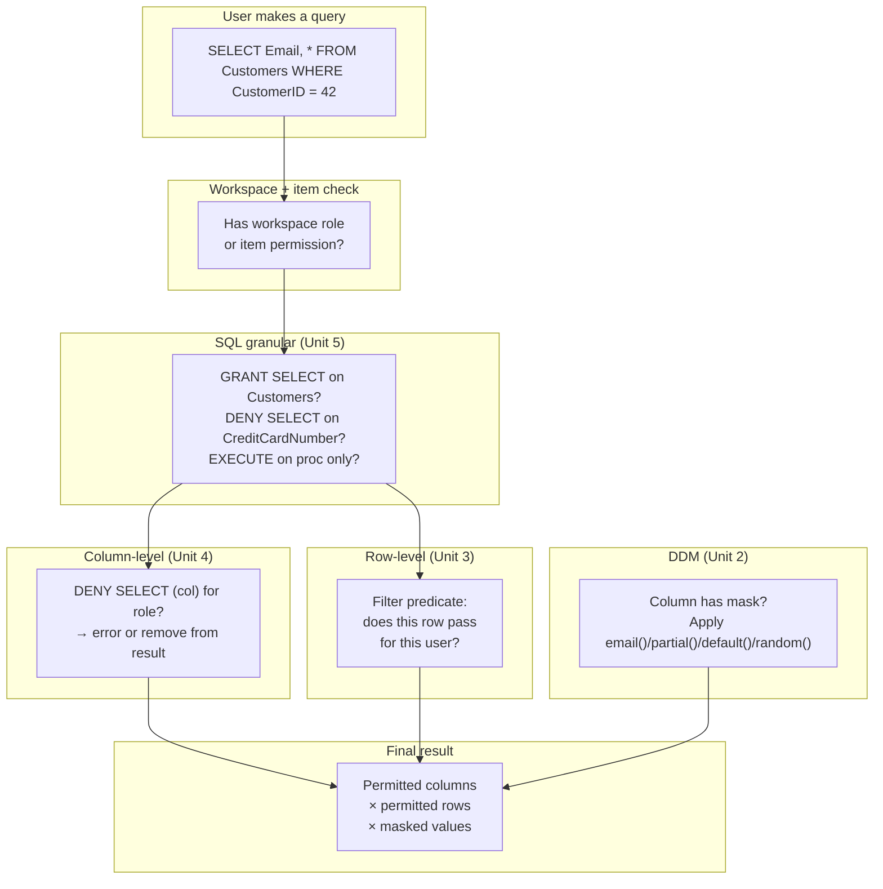

# Unit 8 — Summary

## 🎯 Recap

In this module, you learned how to apply **data protection** controls to a Microsoft Fabric warehouse. These are T-SQL-driven layers that decide **what each user actually sees** once they have access to the warehouse.

> [!info] The four data-protection mechanisms
>
> | Mechanism | What it does | How you apply it |
> |-----------|--------------|------------------|
> | **Dynamic data masking (DDM)** | Obscures column values in query results **without changing the underlying data**. | `ALTER TABLE ... ADD MASKED WITH (FUNCTION = '...')`; control real-data visibility with `UNMASK`. |
> | **Row-level security (RLS)** | Filters which rows a user can see at query time, using a **filter predicate** + **security policy**. | Inline TVF (`WITH SCHEMABINDING`) + `CREATE SECURITY POLICY ... ADD FILTER PREDICATE ... WITH (STATE = ON)`. Predicates apply to admins too — always write an explicit admin exception. |
> | **Column-level security (CLS)** | Restricts access to specific columns using `GRANT` and `DENY`. | `GRANT SELECT ON table TO role` + `DENY SELECT ON table (col) TO role`. Power BI Direct Lake queries **fall back to Direct Query** when CLS is applied. |
> | **SQL granular permissions** | Controls access at the object level — tables, views, functions, and stored procedures. | `GRANT` / `DENY` / `REVOKE`. Apply the principle of **least privilege**: grant only what each user or app needs to do its job. |

## 🧠 One-page mental model

## 🛡️ Defense in depth — the key insight

> [!quote] Stack the controls
> Each of the four mechanisms answers a different question. Used together they form a layered defense:
>
> - **Workspace roles** — "Is this user allowed in?"
> - **Item permissions** — "Is this user allowed into *this* warehouse?"
> - **SQL granular** — "Can this user touch this *object*?"
> - **CLS** — "Can this user touch this *column*?"
> - **RLS** — "Can this user touch this *row*?"
> - **DDM** — "Can this user see the *real value*, or only a masked version?"
>
> A failure in one layer doesn't expose data — the next layer still applies.

## 📚 Learn more

- [Security for data warehousing in Microsoft Fabric](https://learn.microsoft.com/en-us/fabric/data-warehouse/security)
- [Dynamic data masking in Fabric data warehousing](https://learn.microsoft.com/en-us/fabric/data-warehouse/dynamic-data-masking)
- [Row-level security in Fabric data warehousing](https://learn.microsoft.com/en-us/fabric/data-warehouse/row-level-security)
- [Column-level security in Fabric data warehousing](https://learn.microsoft.com/en-us/fabric/data-warehouse/column-level-security)
- [SQL granular permissions in Microsoft Fabric](https://learn.microsoft.com/en-us/fabric/data-warehouse/sql-granular-permissions)

## 🔑 Module-level takeaways

> [!success] What you should now be able to do
> 1. **List the five security layers** of a Fabric warehouse and explain the role of each.
> 2. **Apply DDM** with the right mask function (`default()`, `email()`, `partial()`, `random()`) for the data type and risk.
> 3. **Implement RLS** with an inline TVF predicate (`WITH SCHEMABINDING`) and a `CREATE SECURITY POLICY` binding.
> 4. **Implement CLS** by combining table-wide `GRANT SELECT` with column-specific `DENY SELECT`.
> 5. **Configure SQL granular permissions** with `GRANT` / `DENY` / `REVOKE`, remembering that **`DENY` always wins**.
> 6. **Apply least privilege** in real warehouse designs, including the `EXECUTE`-only-on-procedures pattern.
> 7. **Recognize side-channel risks** (inference attacks, divide-by-zero probes) and combine controls to mitigate them.

## 🧭 Done — module complete

You've finished **Module 2 of Path 5: Secure data access**. The next modules in this path deepen the topic (typically OneLake-level security and external sharing). Return to the [_MOC](./_MOC.md) for navigation.

↑ [_MOC](./_MOC.md)