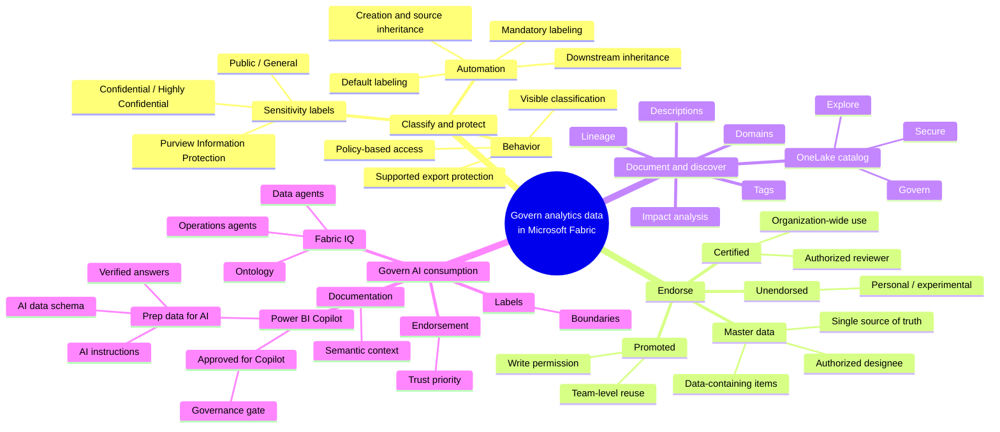
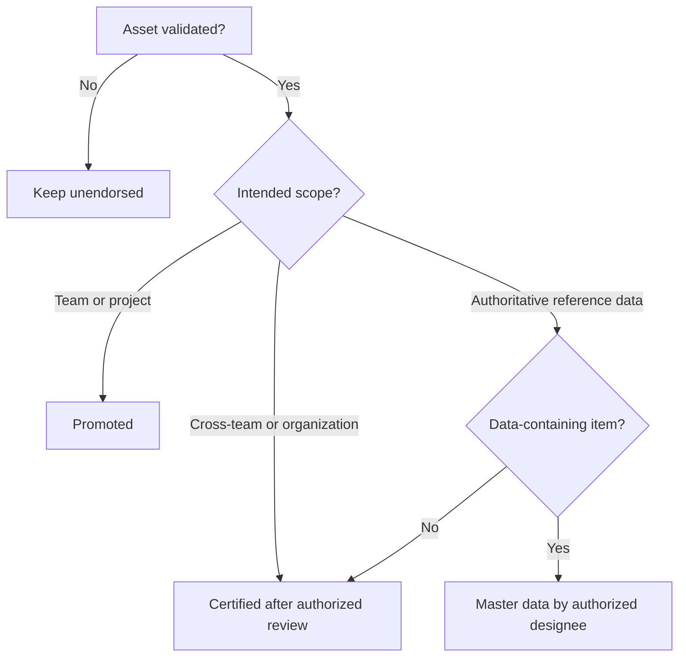
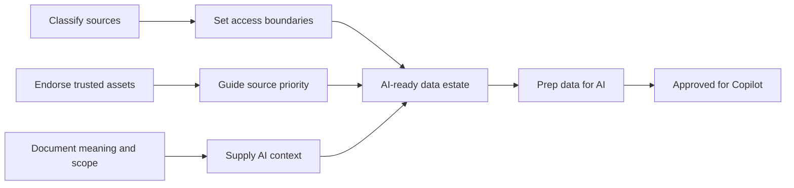

# Govern analytics data in Microsoft Fabric — Mind Map

```mermaid
mindmap
  root((Govern analytics data<br/>in Microsoft Fabric))
    Classify and protect
      Sensitivity labels
        Purview Information Protection
        Public / General
        Confidential / Highly Confidential
      Behavior
        Visible classification
        Policy-based access
        Supported export protection
      Automation
        Default labeling
        Mandatory labeling
        Downstream inheritance
        Creation and source inheritance
    Endorse
      Unendorsed
        Personal / experimental
      Promoted
        Write permission
        Team-level reuse
      Certified
        Authorized reviewer
        Organization-wide use
      Master data
        Authorized designee
        Data-containing items
        Single source of truth
    Document and discover
      Descriptions
      Tags
      Domains
      Lineage
      Impact analysis
      OneLake catalog
        Explore
        Govern
        Secure
    Govern AI consumption
      Labels
        Boundaries
      Endorsement
        Trust priority
      Documentation
        Semantic context
      Fabric IQ
        Ontology
        Data agents
        Operations agents
      Power BI Copilot
        Prep data for AI
          AI data schema
          AI instructions
          Verified answers
        Approved for Copilot
          Governance gate
```

## Endorsement decision flow

```mermaid
flowchart TD
  A[Asset validated?] -->|No| U[Keep unendorsed]
  A -->|Yes| S{Intended scope?}
  S -->|Team or project| P[Promoted]
  S -->|Cross-team or organization| C[Certified after authorized review]
  S -->|Authoritative reference data| D{Data-containing item?}
  D -->|Yes| M[Master data by authorized designee]
  D -->|No| C
```

## Governance-to-AI flow

```mermaid
flowchart LR
  S[Classify sources] --> B[Set access boundaries]
  E[Endorse trusted assets] --> T[Guide source priority]
  D[Document meaning and scope] --> C[Supply AI context]
  B --> A[AI-ready data estate]
  T --> A
  C --> A
  A --> P[Prep data for AI]
  P --> G[Approved for Copilot]
```

↑ [[_MOC]]
