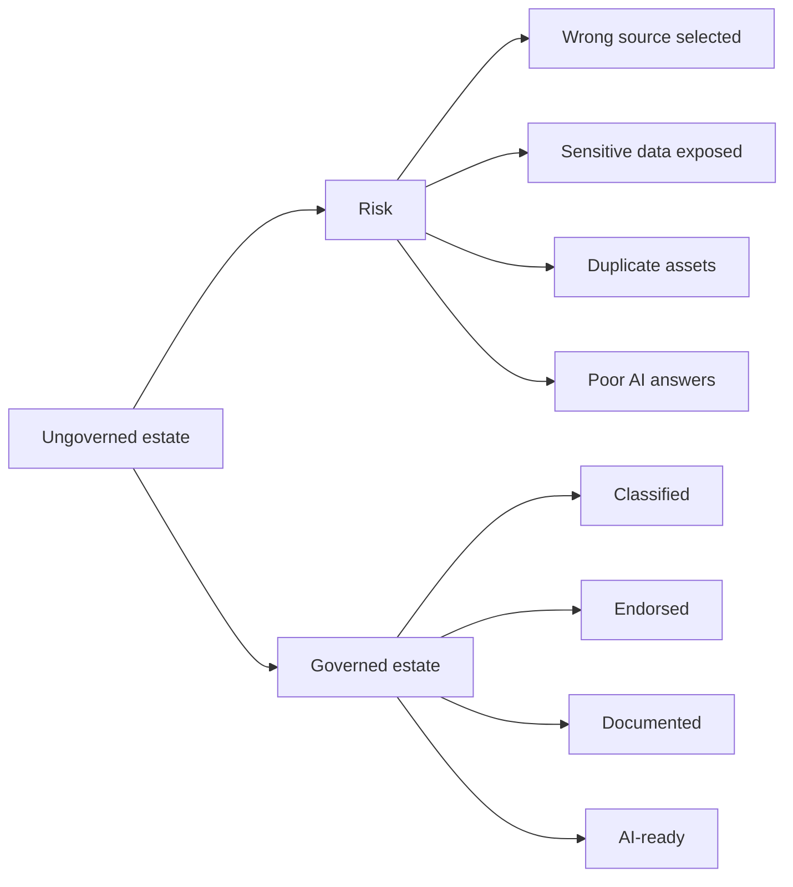

# Unit 1 — Introduction

## 🎯 Why this matters

As Fabric adoption grows, lakehouses, warehouses, semantic models, and reports multiply. Without governance, consumers cannot reliably distinguish authoritative assets from experiments, and sensitive data can reach unauthorized users or AI agents.

> [!quote] Scenario
> An uncertified dataset produces incorrect executive projections while an AI agent surfaces confidential salary data because the source has no sensitivity label.

## 🔑 Governance outcomes

- **Classification** identifies sensitivity and enables protection.
- **Endorsement** signals whether an asset is trustworthy and reusable.
- **Documentation** makes meaning, scope, and lineage discoverable.
- **OneLake catalog** centralizes discovery and governance posture.
- **AI governance** ensures agents use permitted, authoritative, understandable data.

> [!success] Target state
> Humans and AI agents can find, evaluate, and consume trusted data while respecting protection boundaries.

## 🧭 Next

→ [[Unit-2-Classify-and-Protect]]  
↑ [[_MOC]]
