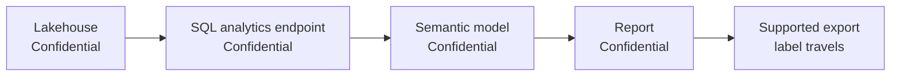

# Unit 2 — Classify and protect data in Microsoft Fabric

## 🎯 Core idea

Microsoft Purview Information Protection sensitivity labels classify Fabric items and can enforce protection. Labels are visible metadata, can travel with supported exports, and can propagate through lineage.

> [!info] Scope
> Labels apply across lakehouses, warehouses, semantic models, reports, notebooks, and pipelines. They require Purview Information Protection licensing and administrator configuration.

## 🏷️ Classification cues

| Data characteristic | Typical classification |
|---|---|
| PII: names, addresses, email | Confidential or higher |
| Salaries, revenue, account numbers | Confidential or higher |
| Health or regulated records | Highly Confidential |
| Published reports or marketing metrics | Public or General |
| Experimental or exploratory data | General baseline |

## What labels do

- Display classification in the Fabric portal and OneLake catalog.
- Enforce access through associated Purview protection policies.
- Travel through supported exports: Excel, PDF, PowerPoint, and `.pbix`.
- Do **not** carry protection into CSV or TXT exports; Fabric warns the user.

## 🔄 Automatic labeling capabilities

| Capability | Effect |
|---|---|
| **Default labeling** | New items receive a baseline label when none is chosen. |
| **Mandatory labeling** | Users cannot save supported Power BI items without a label; support for non-Power BI items is limited. |
| **Downstream inheritance** | A label propagates from an upstream item to dependent items. |
| **Inheritance upon creation** | A child created from a labeled parent inherits the label. |
| **Inheritance from data sources** | Power BI semantic models inherit labels from labeled sources. |

> [!important] Exam pattern
> To protect an **entire lineage**, choose **downstream inheritance**. Label source items at ingestion, enable default labeling, and use the OneLake catalog Govern tab to find gaps.

> [!warning] Labels and access
> A user who cannot open an item may be blocked by a protection policy associated with its sensitivity label. Labels are not merely visual when policies enforce them.

> [!tip] Without Purview
> Use naming conventions, descriptions, and tags as informal classification. They improve visibility but do not provide Purview enforcement.

## 🧭 Next

→ [[Unit-3-Endorse-and-Document]]  
← [[Unit-1-Introduction]]  
↑ [[_MOC]]
