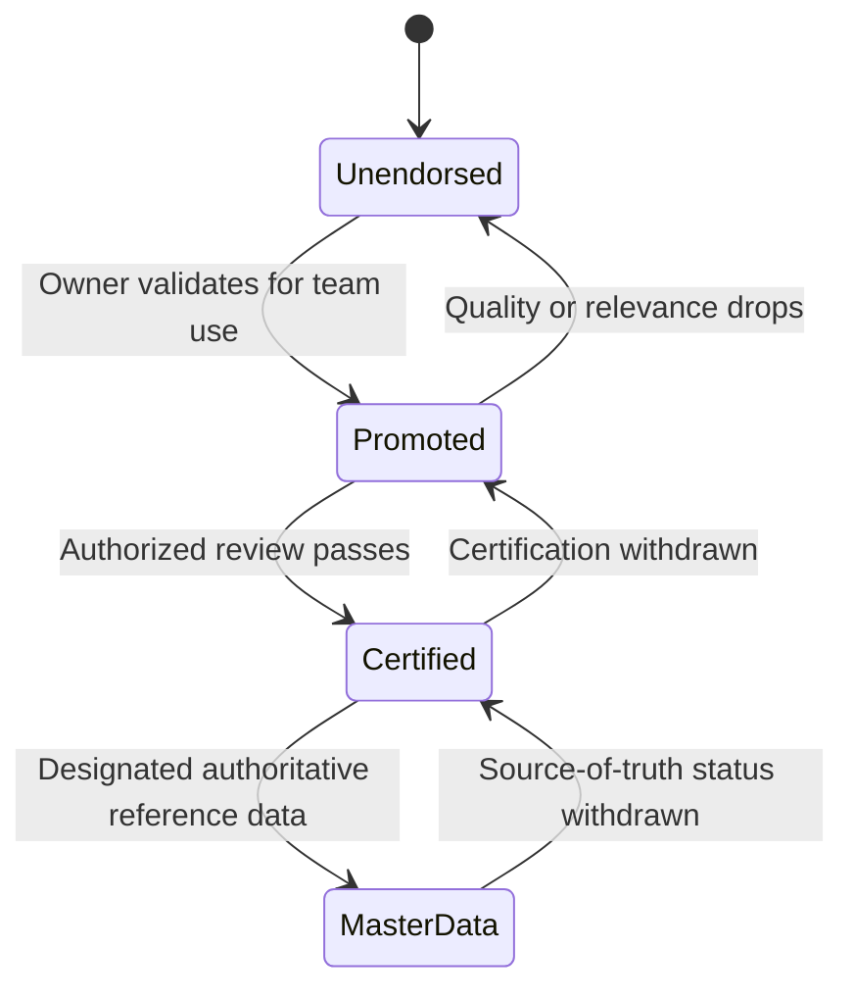

# Unit 3 — Endorse and document data assets

## 🎯 Core idea

Classification communicates sensitivity; endorsement communicates trust. Endorsed items display badges, rank higher in search, and help both users and AI choose authoritative sources.

## 🏅 Endorsement levels

| Level | Who applies it | Intended scope | Example |
|---|---|---|---|
| **Promoted** | Any user with write permission | Tested and reusable within a team or project | Team sales model |
| **Certified** | Authorized reviewer designated by Fabric/domain admins | Quality-approved for cross-team or organization-wide use | Production model feeding executive reports |
| **Master data** | Users specified by Fabric admin; data-containing items only | Authoritative single source of truth | Product catalog, customer master, financial hierarchy |

> [!important] Master data
> For an authoritative organizational reference dataset, choose **Master data**, not merely Certified.

Nearly all Fabric and Power BI items can be promoted or certified. Power BI dashboards are the exception. An unendorsed asset implicitly signals personal, experimental, or unreviewed work.

## 🔄 Endorsement lifecycle

> [!warning] Lifecycle nuance
> Master data is a special designation for data-containing items, not a mandatory final stage for every certified asset.

## 📝 Discoverability practices

- Add specific **item descriptions** so users can assess assets without opening them.
- Use **lineage view** to understand source-to-destination dependencies.
- Run **impact analysis** before changing an upstream item.
- Assign items to the appropriate **domain**.
- Apply administrator-defined **tags** for business area, refresh frequency, or other categories.

## 🗂️ OneLake catalog tabs

| Tab | Purpose |
|---|---|
| **Explore** | Find and filter items by domain, type, endorsement, and keywords. |
| **Govern** | Review governance posture and recommendations, such as missing descriptions or labels. |
| **Secure** | View and edit workspace roles and OneLake security roles centrally. |

The catalog combines endorsements, tags, descriptions, sensitivity labels, and domains. It is also embedded in Teams, Excel, and Copilot Studio.

> [!tip] Reuse before rebuilding
> Search for Certified or Master data items before creating a new dataset. Reuse reduces duplication and improves consistency.

## 🧭 Next

→ [[Unit-4-Govern-Data-for-AI]]  
← [[Unit-2-Classify-and-Protect]]  
↑ [[_MOC]]
