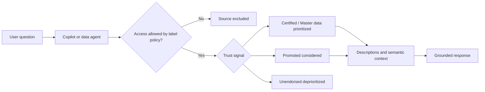
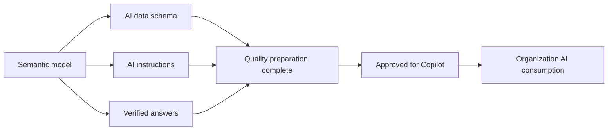

# Unit 4 — Govern data for AI consumption

## 🎯 Governance signals for AI

AI agents use the same controls as human consumers, but interpret them programmatically:

| Signal | AI effect |
|---|---|
| **Sensitivity labels** | Set access boundaries; protection policies prevent agents from surfacing blocked data. |
| **Endorsement** | Signals authority; certified sources are preferred over unpromoted ones. |
| **Descriptions and metadata** | Explain scope and meaning, improving answer specificity and accuracy. |

## Connect governance to Fabric IQ

- **Ontology (preview):** business concepts bind to selected OneLake sources; governance helps ensure those bindings are trustworthy and understood.
- **Data agents:** query semantic models, lakehouses, and warehouses using sensitivity and endorsement metadata.
- **Operations agents (preview):** monitor eventhouse streams and recommend or trigger actions through Teams and Power Automate; governed sources improve rule reliability.

## Build an AI-ready foundation

1. **Endorse before exposing:** Promoted for team use, Certified for organization-wide use, Master data for business-critical reference sources.
2. **Classify to set boundaries:** label personal, financial, and restricted data.
3. **Document for context:** use specific item and column descriptions.
4. **Monitor in OneLake catalog:** close gaps surfaced in the Govern tab.

| Documentation quality | Likely behavior |
|---|---|
| None | Agent may use a technical name or skip the item. |
| “Sales data” | Limited context; vague or incomplete response. |
| “Monthly retail sales revenue by region and product category, refreshed daily from the certified lakehouse” | Clear scope and refresh context; more accurate response. |

## ✅ Approved for Copilot

This semantic-model setting is a formal governance gate:

- Removes friction warnings from standalone Copilot answers using that model.
- Treats reports built on the model as Approved for Copilot.
- Allows workspaces to show only approved items in standalone Copilot.
- May take up to 24 hours to propagate, although most changes appear within an hour.

### Prepare first, approve second

**Prep data for AI** offers:

- **AI data schema:** focused tables, columns, and measures for Copilot.
- **AI instructions:** natural-language business rules, terminology, and use cases.
- **Verified answers:** validated visuals associated with trigger phrases.

> [!important] Distinction
> **Prep data for AI** improves answer quality. **Approved for Copilot** is the governance gate that signals readiness.

## 🧭 Next

→ [[Unit-5-Exercise]]  
← [[Unit-3-Endorse-and-Document]]  
↑ [[_MOC]]
