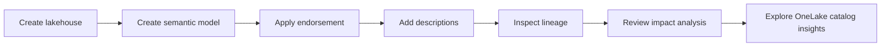

# Unit 5 — Exercise: Govern analytics data in Microsoft Fabric

> [!info] Lab profile
> Approximate duration: **30 minutes**. Requires access to a Fabric-enabled workspace. The public unit launches a separate exercise; this note summarizes its purpose rather than reproducing lab steps.

## What the lab does

You create a lakehouse and semantic model, then apply Fabric governance capabilities that do not require additional tools or licensing:

- Promote an item to signal readiness and reuse.
- Add descriptions to improve discoverability.
- Inspect lineage between the lakehouse, semantic model, and related assets.
- Use impact analysis to understand downstream consequences before changes.
- Explore OneLake catalog governance insights and coverage.

## Skills practiced

| Lab activity | Governance concept |
|---|---|
| Create connected Fabric items | Establish a lineage chain |
| Promote assets | Team-level trust signal |
| Add descriptions | Human and AI discoverability |
| Review lineage | Understand dependencies |
| Use impact analysis | Assess downstream change risk |
| Inspect catalog insights | Monitor governance posture |

> [!tip] Before you start
> Review [[Unit-3-Endorse-and-Document]] so you can distinguish endorsement, descriptions, lineage, impact analysis, and catalog responsibilities.

> [!success] Expected outcome
> You can explain how simple governance signals make a growing Fabric estate easier to trust, discover, and change safely.

## 🧭 Next

→ [[Unit-6-Knowledge-Check]]  
← [[Unit-4-Govern-Data-for-AI]]  
↑ [[_MOC]]
