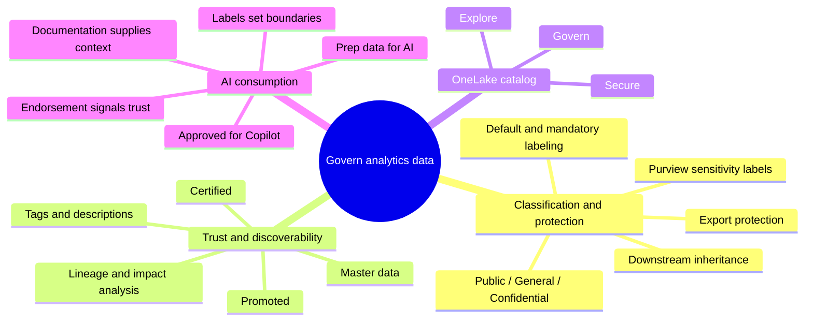
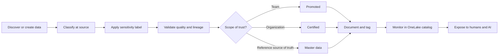

# Module — Govern analytics data in Microsoft Fabric

> [!info] Module map
> Path 5 · Module 3 explains how Fabric governance establishes **protection, trust, discoverability, and AI readiness** across lakehouses, warehouses, semantic models, reports, and other items.

## 🎯 Learning objectives

- Apply data classification and sensitivity labels to Fabric items.
- Use Promoted, Certified, and Master data endorsement appropriately.
- Document assets for discoverability and impact analysis.
- Explain how governance controls affect AI consumption.
- Use Explore, Govern, and Secure in the OneLake catalog.

## 🧠 Module mind map

## 📑 Unit breakdown

| # | Unit | XP | Minutes | Focus |
|---|---|---:|---:|---|
| 1 | [[Unit-1-Introduction]] | 100 | 2 | Governance problem and module scope |
| 2 | [[Unit-2-Classify-and-Protect]] | 100 | 6 | Sensitivity labels, protection, propagation |
| 3 | [[Unit-3-Endorse-and-Document]] | 100 | 6 | Endorsement, tags, documentation, OneLake catalog |
| 4 | [[Unit-4-Govern-Data-for-AI]] | 100 | 8 | AI boundaries, trust, context, Copilot approval |
| 5 | [[Unit-5-Exercise]] | 100 | 30 | Lab summary: create and govern Fabric assets |
| 6 | [[Unit-6-Knowledge-Check]] | 200 | 3 | Five assessment questions |
| 7 | [[Unit-7-Summary]] | 100 | 2 | Consolidated review |

**Total: 800 XP · 57 minutes**

## 🔄 Governance workflow

> [!important] Exam anchor
> Sensitivity labels answer **“how sensitive is it?”**; endorsement answers **“how trustworthy is it?”**; documentation answers **“what does it mean?”**; Approved for Copilot answers **“is this semantic model ready for AI?”**

## 🧭 Study path

Start with [[Unit-1-Introduction]] and continue sequentially. Use [[Module-Mind-Map]] for rapid review.

## 📚 Source

<https://learn.microsoft.com/en-us/training/modules/fabric-govern-analytics-data/>
